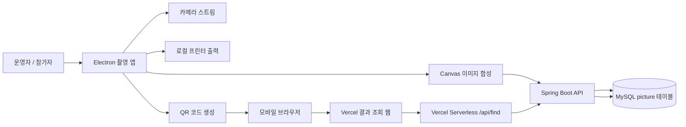
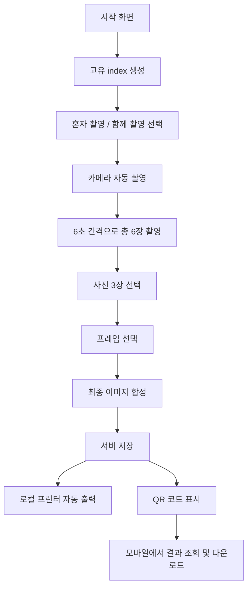
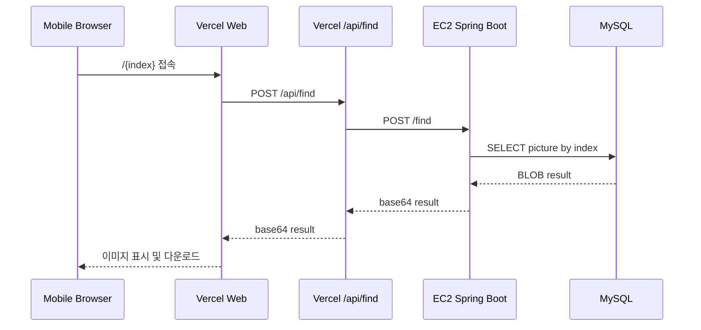

# GBCamera 포트폴리오 정리

## 1. 프로젝트 한 줄 소개

GBCamera는 축제 및 행사 부스에서 운영되는 인생네컷 촬영 과정을 자동 사진 촬영, 프레임 합성, 결과 저장, QR 공유, 무인 출력까지 연결한 포토부스 자동화 프로젝트입니다.

기존에 수동으로 운영하던 포토부스 프로젝트를 기반으로, React, Spring Boot, Electron, Vercel, AWS EC2, Docker를 활용해 실제 현장에서 운영 가능한 형태로 개선했습니다. 개인 프로젝트로 기획, 프론트엔드, 백엔드, 데스크톱 앱 패키징, 배포 인프라 구축, 현장 운영까지 단독으로 진행했으며, 중고등학생 약 50명을 대상으로 부스를 실제 운영했습니다.

## 2. 프로젝트 개요

| 항목 | 내용 |
| --- | --- |
| 프로젝트명 | GBCamera |
| 형태 | 개인 프로젝트 |
| 목적 | 행사 부스용 인생네컷 촬영, 편집, 출력 자동화 |
| 주요 사용자 | 축제 및 체험 부스 참가자, 부스 운영자 |
| 핵심 가치 | 운영자 개입 최소화, 촬영부터 출력까지 자동화, QR 기반 모바일 다운로드 |
| 실제 운영 | 중고등학생 약 50명 대상 포토부스 운영 |
| 이전 버전 | 2024년 수동 운영 프로젝트 `GB_Camera` 개선 |
| 대표 기능 | 자동 촬영, 사진 선택, 프레임 선택, 이미지 합성, QR 공유, 자동 프린트 |

## 3. 문제 정의

기존 수동 포토부스 운영 방식에는 다음과 같은 문제가 있었습니다.

| 기존 문제 | 개선 방향 |
| --- | --- |
| 촬영, 편집, 출력 과정에 운영자 개입이 필요함 | 촬영 시작 후 자동 시퀀스로 진행 |
| 사진 선택과 프레임 적용이 수동 작업에 가까움 | 화면 내에서 참가자가 직접 선택하고 Canvas로 즉시 합성 |
| 브라우저만으로는 로컬 프린터를 안정적으로 제어하기 어려움 | Electron 앱으로 패키징해 로컬 장치 접근과 무인 출력 구현 |
| 결과 사진을 휴대폰으로 전달하는 과정이 번거로움 | QR 코드로 개인 결과 페이지 접속 및 다운로드 |
| 행사 컨셉 변경 시 화면과 프레임을 매번 손봐야 함 | 프레임 이미지와 테마 선택 흐름을 분리해 확장성 확보 |
| 배포 및 서버 실행 환경이 수동적임 | Docker, GitHub Actions, AWS EC2, Vercel을 활용한 배포 구조 학습 및 구축 |

## 4. 핵심 성과

- React 기반 촬영 운영 앱과 결과 조회 웹을 분리해 사용자 흐름을 명확히 구성했습니다.
- Electron을 활용해 웹 기반 UI를 데스크톱 앱으로 패키징하고, 로컬 프린터 제어 기능을 구현했습니다.
- 카메라 설정, 프린터 선택, 촬영, 이미지 합성, 서버 저장, QR 공유, 출력까지 하나의 흐름으로 자동화했습니다.
- Spring Boot와 MyBatis로 이미지 결과 저장 및 조회 API를 구현했습니다.
- MySQL BLOB 저장 방식을 사용해 최종 합성 이미지를 index 기반으로 조회할 수 있게 설계했습니다.
- Vercel 서버리스 API를 프록시로 사용해 HTTPS 프론트엔드와 HTTP 백엔드 간 Mixed Content 및 CORS 문제를 우회했습니다.
- Docker 멀티 스테이지 빌드와 GitHub Actions로 백엔드 이미지를 Docker Hub에 자동 빌드 및 푸시하도록 구성했습니다.
- AWS EC2에서 백엔드를 운영하고, Vercel에 결과 조회 웹을 배포해 실제 부스 운영에 활용했습니다.
- 실제 중고등학생 약 50명을 대상으로 부스를 운영하며, 단순 데모가 아닌 현장 사용 가능한 서비스로 검증했습니다.

## 5. 담당 역할

개인 프로젝트로 전체 과정을 단독 수행했습니다.

| 영역 | 수행 내용 |
| --- | --- |
| 기획 | 기존 수동 포토부스 운영 문제 분석, 자동화 목표 설정 |
| 프론트엔드 | React 기반 촬영 앱, 결과 조회 웹, 상태 관리, 라우팅, Canvas 이미지 합성 구현 |
| 데스크톱 앱 | Electron 기반 앱 패키징, 프린터 목록 조회, 무인 출력 IPC 구현 |
| 백엔드 | Spring Boot API, MyBatis Mapper, MySQL 연동, 이미지 저장 및 조회 로직 구현 |
| 데이터베이스 | `picture` 테이블 설계, index 기반 이미지 BLOB 저장 구조 구성 |
| 인프라 | Vercel 웹 배포, AWS EC2 백엔드 운영, Docker 이미지 빌드, GitHub Actions CI/CD 구성 |
| 현장 운영 | 카메라 및 프린터 연결, 부스 운영 플로우 테스트, 약 50명 대상 실제 운영 |

## 6. 기술 스택

### Frontend

| 기술 | 사용 목적 |
| --- | --- |
| React 19.1.1 | 촬영 앱 및 결과 조회 웹 UI 구현 |
| TypeScript | 컴포넌트, 상태, Electron bridge 타입 안정성 확보 |
| Vite 5.4.8 | 빠른 개발 서버 및 빌드 |
| React Router DOM 7.9.4 | 촬영 단계별 화면 라우팅 |
| Zustand 5.0.8 | 촬영 상태, 선택 이미지, 카메라 설정, 결과 이미지 전역 관리 |
| QRCode.react 4.2.0 | 결과 페이지 접속용 QR 코드 생성 |
| Canvas API | 촬영 이미지 캡처, 프레임 합성, 최종 결과 이미지 생성 |

### Desktop App

| 기술 | 사용 목적 |
| --- | --- |
| Electron 39.0.0 | 웹 UI를 데스크톱 앱으로 패키징 |
| Electron Builder 26.0.12 | Windows `.exe`, macOS `.dmg` 빌드 구성 |
| Electron IPC | Renderer와 Main Process 간 프린터 목록 조회 및 출력 요청 |
| Context Bridge | `window.electronAPI`를 안전하게 노출 |

### Backend

| 기술 | 사용 목적 |
| --- | --- |
| Java 17 | Spring Boot 백엔드 런타임 |
| Spring Boot 3.5.7 | REST API 서버 구현 |
| Spring MVC | `/index`, `/index/result`, `/find` API 제공 |
| Spring Security | CSRF 비활성화, CORS 설정, 공개 API 접근 허용 |
| Spring Validation | 요청 DTO 유효성 검증 |
| MyBatis 3.0.5 | SQL Mapper 기반 DB 접근 |
| Lombok 1.18.42 | DTO, VO 코드 간결화 |
| MySQL Connector/J 9.4.0 | MySQL 연동 |

### Database

| 기술 | 사용 목적 |
| --- | --- |
| MySQL 8.0.44 | 촬영 결과 저장 |
| LONGBLOB | 최종 합성 이미지 바이너리 저장 |
| Primary Key index | QR 링크와 결과 이미지 매핑 |

### Infra

| 기술 | 사용 목적 |
| --- | --- |
| Vercel | 결과 조회 웹 배포, 서버리스 프록시 |
| AWS EC2 | Spring Boot 백엔드 운영 |
| Docker | 백엔드 실행 환경 컨테이너화 |
| Docker Hub | 백엔드 이미지 저장소 |
| GitHub Actions | Docker 이미지 자동 빌드 및 푸시 |

## 7. 전체 아키텍처



### 구성 설명

- 촬영 운영 앱은 Electron으로 실행되며 카메라와 프린터 같은 로컬 장치를 제어합니다.
- 촬영된 사진은 Canvas에서 프레임과 합성되어 최종 이미지로 만들어집니다.
- 최종 이미지는 Base64 payload로 변환되어 Spring Boot API에 저장됩니다.
- 백엔드는 이미지를 MySQL `picture.result` 컬럼에 BLOB으로 저장합니다.
- 참가자는 QR 코드를 휴대폰으로 스캔해 Vercel 결과 페이지에 접속합니다.
- Vercel 결과 페이지는 `/api/find` 서버리스 함수를 통해 백엔드에서 이미지를 조회합니다.
- 조회된 Base64 이미지는 브라우저에서 표시되고 다운로드할 수 있습니다.

## 8. 사용자 플로우



### 실제 화면 단계

| 단계 | 설명 | 주요 코드 |
| --- | --- | --- |
| 시작 | 촬영 시작 버튼 클릭 시 백엔드에서 고유 index 생성 | `GBCamera_FrontApp-main/src/pages/Home.tsx` |
| 테마 선택 | 혼자 촬영 또는 캐릭터와 함께 촬영 선택 | `GBCamera_FrontApp-main/src/pages/SelectThema.tsx` |
| 카메라 설정 | 해상도, FPS, 전후면, 장치, 프린터 선택 | `GBCamera_FrontApp-main/src/pages/Setting.tsx` |
| 자동 촬영 | 6초 타이머로 총 6장 촬영, 셔터 사운드 재생 | `GBCamera_FrontApp-main/src/pages/TakePicture.tsx` |
| 사진 선택 | 촬영 결과 중 원하는 사진 3장 선택 | `GBCamera_FrontApp-main/src/pages/SelectImage.tsx` |
| 프레임 선택 | 테마별 프레임 적용 및 최종 합성 | `GBCamera_FrontApp-main/src/pages/SelectFrame.tsx` |
| 저장 및 출력 | 서버 저장, 프린터 출력, QR 화면 이동 | `GBCamera_FrontApp-main/src/pages/SelectFrame.tsx` |
| QR 공유 | 결과 페이지 URL을 QR로 제공 | `GBCamera_FrontApp-main/src/pages/QR.tsx` |
| 결과 조회 | 모바일에서 결과 이미지 조회 및 다운로드 | `GBCamera_FrontEnd-main/src/pages/Result.tsx` |

## 9. 주요 기능 상세

### 9.1 고유 index 생성

촬영 시작 시 백엔드 `POST /index`를 호출해 참가자별 고유 index를 생성합니다.

- `SecureRandom`으로 URL-safe Base64 기반 랜덤 문자열 생성
- 기본 길이 22자의 index 사용
- DB 중복 여부 확인 후 insert
- 동시성 충돌을 고려해 `DuplicateKeyException` 발생 시 재시도
- 최대 10회 재시도 후 실패 처리

관련 코드:

- `GBCamera_BackEnd-main/src/main/java/com/camera/gbcamera_backend/service/IndexService.java`
- `GBCamera_BackEnd-main/src/main/java/com/camera/gbcamera_backend/controller/IndexController.java`

### 9.2 카메라 설정과 스트림 관리

촬영 전에 운영자가 카메라 환경을 조정할 수 있습니다.

- `navigator.mediaDevices.getUserMedia`로 카메라 스트림 획득
- `enumerateDevices`로 사용 가능한 카메라 목록 조회
- 해상도 옵션: 720p, 1080p, 4K
- FPS 범위: 15-60
- `deviceId` 기반 특정 카메라 선택
- `facingMode` 기반 전면/후면 전환
- 기존 스트림 track을 종료해 장치 중복 점유 방지
- Zustand에 stream과 설정값을 저장해 화면 이동 후에도 유지

이 기능 덕분에 현장에서 노트북, 웹캠, 모바일 장치 등 촬영 환경이 달라져도 운영자가 앱 안에서 빠르게 조정할 수 있습니다.

### 9.3 자동 촬영 시퀀스

`TakePicture.tsx`에서 촬영 흐름을 자동화했습니다.

- 총 촬영 수: 6장
- 촬영 간격: 6초
- 남은 촬영 수와 타이머를 화면에 표시
- 촬영 시 셔터 사운드 재생
- 마지막 촬영 후 자동으로 사진 선택 화면 이동

촬영 이미지는 Canvas를 통해 JPEG dataURL로 저장됩니다.

### 9.4 촬영 이미지 비율 보정

카메라 원본 비율과 출력 프레임 비율이 다를 수 있어, Canvas에서 `object-fit: cover`와 같은 방식으로 중앙 크롭을 직접 구현했습니다.

- 캡처 해상도: 1023 x 476
- 카메라 원본 `videoWidth`, `videoHeight` 확인
- Canvas 비율과 영상 비율 비교
- 영상이 더 넓으면 좌우 크롭
- 영상이 더 세로로 길면 상하 크롭
- 전면 카메라 사용 시 좌우 반전 적용

이를 통해 다양한 웹캠 환경에서도 프레임 안에 이미지가 어색하게 찌그러지지 않도록 처리했습니다.

### 9.5 함께 촬영 모드

혼자 촬영뿐 아니라 캐릭터 또는 테마 오버레이와 함께 촬영하는 모드를 제공합니다.

- 테마 선택 값이 `2`인 경우 오버레이 프레임 활성화
- 6장 촬영을 2장 단위로 나누어 3개의 오버레이 프레임 적용
- 촬영 미리보기에도 동일한 오버레이를 표시
- 실제 저장 이미지에도 같은 프레임을 합성

관련 이미지:

- `GBCamera_FrontApp-main/src/image/tema1.png`
- `GBCamera_FrontApp-main/src/image/tema2.png`
- `GBCamera_FrontApp-main/src/image/tema3.png`

### 9.6 사진 선택

촬영된 6장 중 참가자가 원하는 3장을 선택할 수 있습니다.

- 오른쪽에 6개 썸네일 표시
- 선택된 이미지는 테두리와 투명도로 구분
- 이미 선택한 이미지는 다시 클릭해 선택 해제 가능
- 최대 3장까지 선택 제한
- 선택된 이미지는 `selectImg` 상태로 저장

최종 결과물은 인생네컷 형태의 세로 프레임에 3장의 사진이 들어가는 구조입니다.

### 9.7 프레임 합성

프레임 선택 화면에서 최종 이미지를 Canvas로 합성합니다.

- 최종 프레임 기준 크기: 1181 x 1772
- 3개 슬롯에 선택된 사진 배치
- 슬롯 위치는 비율 기반으로 계산
- `devicePixelRatio`를 반영해 고해상도 화면에서도 선명하게 렌더링
- 프레임 이미지를 마지막에 draw해 사진 위에 자연스럽게 덮이도록 구성
- 테마에 따라 프레임 세트 분기
  - 혼자 촬영: `1.png`부터 `6.png`
  - 함께 촬영: `7.png`부터 `12.png`

### 9.8 서버 저장

최종 합성 이미지는 dataURL에서 Base64 payload만 분리한 뒤 백엔드로 저장합니다.

프론트 요청:

```http
PUT /index/result
Content-Type: application/json
x-index: {index}

{
  "base64": "{imageBase64}"
}
```

백엔드 처리:

- `x-index` 헤더에서 index 추출
- JSON body의 Base64 문자열 검증
- Base64 디코딩
- MySQL `picture.result` 컬럼에 BLOB 업데이트
- 존재하지 않는 index이면 예외 처리

### 9.9 무인 프린트

일반 브라우저 환경에서는 보안 정책 때문에 로컬 프린터를 무인 제어하기 어렵습니다. 이 문제를 해결하기 위해 촬영 운영 앱을 Electron으로 패키징했습니다.

구현 방식:

- Main Process에서 `ipcMain.handle('printers:list')` 등록
- Renderer에서는 `window.electronAPI.listPrinters()`로 프린터 목록 조회
- 선택한 프린터명은 `localStorage`에 저장
- 출력 시 `window.electronAPI.printImage()` 호출
- Electron Main Process에서 숨겨진 `BrowserWindow` 생성
- dataURL 이미지를 HTML에 삽입
- 이미지 로딩 완료 후 `webContents.print({ silent: true })` 실행
- `deviceName`, `copies`, `margins`, `printBackground` 옵션 적용

프린터가 연결되어 있지 않거나 Electron 환경이 아닌 경우에는 인쇄를 생략하고 QR 공유만 진행하도록 처리했습니다. 현장 운영에서 프린터 문제로 전체 흐름이 멈추지 않도록 한 fallback입니다.

### 9.10 QR 기반 모바일 다운로드

출력 후에도 참가자가 자신의 사진을 휴대폰에 저장할 수 있도록 QR 코드를 제공합니다.

- QR URL 형식: `https://gb-camera-front-end.vercel.app/{index}`
- `QRCodeCanvas`로 QR 코드 생성
- 참가자는 휴대폰 카메라로 QR 스캔
- Vercel 결과 조회 웹에서 index 기반 이미지 조회
- 결과 이미지를 화면에 표시
- 다운로드 버튼으로 휴대폰에 저장

이 구조는 현장에서 파일을 직접 전송하거나 운영자가 개별 안내를 하지 않아도 되도록 만든 사용자 경험 개선입니다.

## 10. 백엔드 API 정리

| Method | Endpoint | 설명 | 요청 | 응답 |
| --- | --- | --- | --- | --- |
| POST | `/index` | 촬영 세션용 고유 index 생성 | 없음 | `{ "index": "..." }` |
| PUT | `/index/result` | 최종 합성 이미지 저장 | Header `x-index`, Body `{ "base64": "..." }` | 204 No Content |
| POST | `/find` | index로 결과 이미지 조회 | `{ "index": "..." }` | `{ "base64": "..." }` |

### API 설계 의도

- index를 QR 링크의 식별자로 사용해 별도 로그인 없이 결과를 조회할 수 있게 했습니다.
- 이미지 업로드는 JSON Base64 방식으로 단순화했습니다.
- 조회 응답도 Base64로 제공해 프론트에서 즉시 dataURL로 변환할 수 있게 했습니다.
- API 수를 최소화해 현장 운영에서 장애 지점을 줄였습니다.

## 11. 데이터베이스 설계

```sql
CREATE TABLE IF NOT EXISTS `picture` (
  `index` VARCHAR(64) NOT NULL,
  `result` LONGBLOB NULL,
  `created_at` TIMESTAMP NOT NULL DEFAULT CURRENT_TIMESTAMP,
  PRIMARY KEY (`index`)
) ENGINE=InnoDB DEFAULT CHARSET=utf8mb4;
```

### 설계 이유

- `index`: QR URL과 결과 이미지를 연결하는 고유 식별자
- `result`: 최종 합성 이미지를 저장하는 BLOB 컬럼
- `created_at`: 촬영 세션 생성 시각 기록
- Primary Key: 중복 index 방지

### 운영 관점

이미지 파일을 별도 스토리지에 저장하지 않고 DB에 직접 저장해 구조를 단순화했습니다. 개인 프로젝트 및 행사 부스 규모에서는 빠르게 구현하고 운영하기에 적합한 방식이었습니다.

향후 사진 수가 많아지거나 장기 운영 서비스가 된다면 S3 같은 Object Storage에 이미지를 저장하고 DB에는 URL 또는 key만 저장하는 구조로 개선할 수 있습니다.

## 12. 인프라 및 배포

### 12.1 프론트엔드 배포

결과 조회 웹은 Vercel에 배포했습니다.

구성:

- React + Vite SPA
- `vercel.json`에서 SPA fallback 설정
- `/api/:path*` 서버리스 함수 유지
- `/:index` 라우팅으로 QR 접속 처리

관련 파일:

- `GBCamera_FrontEnd-main/vercel.json`
- `GBCamera_FrontEnd-main/api/find.ts`
- `GBCamera_FrontEnd-main/src/pages/Result.tsx`

### 12.2 Vercel Serverless Proxy

Vercel에 배포된 HTTPS 웹에서 HTTP EC2 백엔드로 직접 요청하면 Mixed Content 또는 CORS 문제가 발생할 수 있습니다. 이를 해결하기 위해 Vercel 서버리스 API를 프록시로 두었습니다.

동작 방식:



이 구조 덕분에 모바일 사용자는 Vercel 도메인만 접근하면 되고, 백엔드 주소와 CORS 세부사항은 프록시 내부에 숨길 수 있습니다.

### 12.3 백엔드 Docker

백엔드는 멀티 스테이지 Dockerfile로 빌드합니다.

- Build stage: `eclipse-temurin:17-jdk`
- Gradle Wrapper로 `bootJar` 생성
- Runtime stage: `eclipse-temurin:17-jre`
- 최종 jar만 복사해 실행 이미지 경량화
- `EXPOSE 8080`
- `ENTRYPOINT ["java","-jar","/app/app.jar"]`

관련 파일:

- `GBCamera_BackEnd-main/Dockerfile`

### 12.4 GitHub Actions CI/CD

백엔드 저장소에는 Docker Hub로 이미지를 자동 푸시하는 GitHub Actions가 구성되어 있습니다.

동작 조건:

- `main` 브랜치 push
- 수동 실행 `workflow_dispatch`

주요 단계:

- Checkout
- Docker Hub secret 존재 여부 확인
- Docker Hub 로그인
- Docker Buildx 설정
- Dockerfile 존재 여부 확인
- Docker metadata로 `latest`, `sha` tag 생성
- `docker/build-push-action@v6`로 이미지 빌드 및 푸시
- GitHub Actions cache 사용

관련 파일:

- `GBCamera_BackEnd-main/.github/workflows/docker-publish.yml`

### 12.5 데스크톱 앱 배포

운영 앱은 Electron Builder로 패키징할 수 있습니다.

지원 타깃:

- Windows: NSIS 기반 `.exe`
- macOS: `.dmg`

운영 앱은 브라우저가 아니라 데스크톱 앱으로 실행되기 때문에 프린터 제어와 풀스크린에 가까운 부스 UI를 제공할 수 있습니다.

Vite 설정에서 `base: './'`를 사용해 Electron 배포 시 `file://` 환경에서도 asset 경로가 깨지지 않도록 처리했습니다.

### 12.6 모바일 및 앱화 전략

현장 부스는 카메라, 노트북, 프린터 같은 장비 위치가 바뀔 수 있고, 참가자는 자신의 휴대폰으로 결과물을 받아가야 합니다. 이를 고려해 웹 기능을 단순 브라우저 페이지로만 두지 않고 앱처럼 사용할 수 있는 구조로 분리했습니다.

운영 측면:

- 촬영 운영 화면은 Electron으로 패키징해 설치형 앱처럼 실행할 수 있게 했습니다.
- 프린터 이동 또는 장비 재배치 후에도 앱 내부 설정 화면에서 카메라와 프린터를 다시 선택할 수 있습니다.
- 브라우저 인쇄 다이얼로그에 의존하지 않고 로컬 프린터로 직접 출력합니다.
- 컨트롤러의 `@CrossOrigin` 설정에는 로컬 개발 환경, Vercel, `file://`, `capacitor://localhost`와 같은 앱 실행 환경을 고려한 origin이 포함되어 있습니다.

사용자 측면:

- 참가자는 별도 앱 설치 없이 QR을 스캔해 모바일 브라우저에서 결과를 확인합니다.
- 결과 조회 웹은 Vercel에 배포되어 휴대폰에서도 접근 가능한 링크를 제공합니다.
- 다운로드 버튼을 통해 출력물과 별개로 개인 휴대폰에 결과 이미지를 저장할 수 있습니다.

## 13. DX 개선 포인트

이 프로젝트에서 DX는 개발자 경험뿐 아니라 운영자 경험까지 포함해 개선했습니다.

### 13.1 운영자 DX

| 기존 | 개선 |
| --- | --- |
| 촬영 후 사람이 직접 사진을 관리 | 앱에서 촬영, 선택, 합성까지 진행 |
| 프린터 출력에 수동 조작 필요 | 선택한 프린터로 자동 출력 |
| 카메라 문제가 생기면 외부 설정 필요 | 앱 내부에서 해상도, FPS, 장치 변경 |
| 결과 전달에 별도 파일 공유 필요 | QR로 참가자 휴대폰 다운로드 |
| 프린터가 없으면 흐름 중단 | 인쇄 생략 후 QR만 제공하는 fallback |

### 13.2 개발 및 배포 DX

| 영역 | 개선 내용 |
| --- | --- |
| 빌드 | Vite와 Gradle Wrapper로 재현 가능한 빌드 구성 |
| 앱 패키징 | Electron Builder로 `.exe`, `.dmg` 생성 |
| 백엔드 실행 | Docker 이미지로 환경 의존성 축소 |
| CI/CD | GitHub Actions로 Docker Hub 자동 푸시 |
| 웹 배포 | Vercel로 SPA와 서버리스 프록시 배포 |
| API 연결 | 환경 변수 `VITE_API_BASE_URL`, `API_UPSTREAM`으로 주소 분리 |

## 14. 현장 운영 경험

이 프로젝트는 실제 행사 부스에서 중고등학생 약 50명을 대상으로 운영되었습니다.

운영 흐름:

1. 운영자는 앱 실행 후 카메라와 프린터를 설정합니다.
2. 참가자는 촬영 시작 버튼을 누릅니다.
3. 앱이 자동으로 6장의 사진을 촬영합니다.
4. 참가자는 원하는 사진 3장을 선택합니다.
5. 참가자는 프레임을 선택합니다.
6. 앱이 최종 이미지를 합성하고 서버에 저장합니다.
7. 연결된 프린터로 사진이 자동 출력됩니다.
8. 참가자는 QR을 스캔해 휴대폰으로 결과를 다운로드합니다.

운영을 통해 확인한 점:

- 참가자가 직접 화면 흐름을 따라갈 수 있어 운영자 개입이 줄었습니다.
- 프린터가 연결된 환경에서는 출력까지 자연스럽게 이어졌습니다.
- QR 다운로드 덕분에 출력물 외에도 개인 휴대폰에 결과물을 저장할 수 있었습니다.
- 카메라와 프린터 설정 화면이 있어 현장 장비 변경에 대응하기 쉬웠습니다.

## 15. 트러블슈팅

### 15.1 브라우저에서 무인 프린트가 어려운 문제

문제:

- 일반 웹 브라우저에서는 보안 정책상 로컬 프린터를 silent print로 제어하기 어렵습니다.
- `window.print()`는 인쇄 다이얼로그가 뜨기 때문에 무인 부스 운영에 적합하지 않았습니다.

해결:

- Electron 앱으로 패키징했습니다.
- Main Process에서 숨겨진 BrowserWindow를 만들고 `webContents.print({ silent: true })`를 사용했습니다.
- 프린터 목록을 조회해 운영자가 특정 프린터를 선택할 수 있게 했습니다.

### 15.2 HTTPS 프론트와 HTTP 백엔드 연결 문제

문제:

- Vercel은 HTTPS로 서비스되지만 EC2 백엔드는 HTTP로 운영될 수 있습니다.
- 모바일 브라우저에서 HTTPS 페이지가 HTTP API를 직접 호출하면 Mixed Content 문제가 발생할 수 있습니다.

해결:

- Vercel 서버리스 함수 `/api/find`를 만들었습니다.
- 프론트는 같은 origin의 `/api/find`만 호출합니다.
- 서버리스 함수가 EC2 백엔드 `/find`를 대신 호출합니다.

### 15.3 카메라 화면 비율이 프레임과 맞지 않는 문제

문제:

- 웹캠마다 해상도와 비율이 다릅니다.
- 단순히 Canvas에 그리면 이미지가 늘어나거나 프레임과 어긋날 수 있습니다.

해결:

- Canvas 비율과 비디오 비율을 비교했습니다.
- object-fit cover 방식으로 중앙 크롭을 직접 구현했습니다.
- 전면 카메라는 Canvas draw 단계에서도 좌우 반전을 적용했습니다.

### 15.4 Electron 배포 후 asset 경로 문제

문제:

- Electron 배포 환경에서는 `file://`로 정적 파일을 로드합니다.
- Vite 기본 asset 경로를 그대로 사용하면 이미지나 JS 파일 경로가 깨질 수 있습니다.

해결:

- `vite.config.mts`에서 `base: './'`를 설정했습니다.
- 배포 빌드에서도 상대 경로로 asset이 로드되도록 구성했습니다.

### 15.5 index 중복 가능성

문제:

- QR 조회 식별자가 중복되면 다른 참가자의 결과와 충돌할 수 있습니다.

해결:

- `SecureRandom` 기반 URL-safe index를 생성했습니다.
- DB의 Primary Key로 중복을 방지했습니다.
- 사전 count 확인과 insert 예외 재시도를 함께 적용했습니다.

## 16. 코드 구조

```text
gbcamera
├── README.md
├── GBCamera_BackEnd-main
│   ├── Dockerfile
│   ├── build.gradle
│   ├── .github/workflows/docker-publish.yml
│   └── src/main
│       ├── java/com/camera/gbcamera_backend
│       │   ├── controller/IndexController.java
│       │   ├── service/IndexService.java
│       │   ├── mapper/IndexMapper.java
│       │   ├── dto/IndexDto.java
│       │   ├── vo/Index.java
│       │   ├── security/SecurityConfig.java
│       │   └── config/WebConfig.java
│       └── resources
│           ├── application.properties
│           └── mapper/IndexMapper.xml
├── GBCamera_FrontApp-main
│   ├── package.json
│   ├── vite.config.mts
│   ├── electron
│   │   ├── main.ts
│   │   ├── preload.js
│   │   └── start.js
│   └── src
│       ├── App.tsx
│       ├── pages
│       │   ├── Home.tsx
│       │   ├── Setting.tsx
│       │   ├── SelectThema.tsx
│       │   ├── TakePicture.tsx
│       │   ├── SelectImage.tsx
│       │   ├── SelectFrame.tsx
│       │   └── QR.tsx
│       ├── store/useAppStore.ts
│       ├── lib/printer.ts
│       ├── image
│       └── sound
├── GBCamera_FrontEnd-main
│   ├── package.json
│   ├── vercel.json
│   ├── api
│   │   ├── find.ts
│   │   └── ping.ts
│   └── src
│       ├── App.tsx
│       ├── pages/Result.tsx
│       └── store/useAppStore.ts
└── GBCamera_DB-main
    └── Untitled.sql
```

## 17. 포트폴리오에서 강조할 역량

### 프론트엔드 역량

- React Router 기반 단계형 사용자 플로우 설계
- Zustand를 활용한 촬영 상태와 장치 설정 전역 관리
- MediaDevices API를 활용한 카메라 제어
- Canvas API 기반 이미지 캡처 및 합성
- QR 기반 결과 공유 경험 설계
- 모바일 브라우저에서 결과 조회 및 다운로드 가능한 UI 구현

### 백엔드 역량

- Spring Boot REST API 설계 및 구현
- MyBatis 기반 SQL Mapper 구성
- Base64 이미지 처리 및 BLOB 저장
- CORS 및 Spring Security 설정
- 고유 index 생성과 중복 방지 로직 구현

### 앱 및 로컬 장치 연동 역량

- Electron으로 웹 UI를 데스크톱 앱화
- Context Bridge와 IPC를 통한 안전한 기능 노출
- 로컬 프린터 목록 조회 및 선택
- 인쇄 다이얼로그 없는 자동 출력 구현
- Windows, macOS 배포 타깃 구성

### 인프라 역량

- Vercel SPA 배포
- Vercel 서버리스 프록시 구성
- AWS EC2 백엔드 운영 경험
- Docker 멀티 스테이지 빌드
- GitHub Actions 기반 Docker Hub 자동 배포

### 제품 운영 역량

- 실제 행사 부스 운영을 고려한 사용자 흐름 설계
- 카메라 및 프린터 장애에 대비한 fallback 설계
- 50명 규모의 실제 사용자 운영 경험
- 단순 구현을 넘어 현장 사용성과 운영 효율까지 검증

## 18. 이력서용 요약 문장

아래 문장은 이력서 또는 자기소개서에 압축해서 사용할 수 있습니다.

- 개인 프로젝트로 행사 부스용 인생네컷 자동화 서비스 GBCamera를 개발하고, 중고등학생 약 50명을 대상으로 실제 부스를 운영했습니다.
- React와 Electron을 활용해 카메라 촬영, 사진 선택, 프레임 합성, QR 공유, 로컬 프린터 자동 출력을 하나의 데스크톱 앱 흐름으로 구현했습니다.
- Spring Boot, MyBatis, MySQL을 이용해 촬영 세션별 고유 index 생성, 최종 이미지 BLOB 저장, QR 기반 결과 조회 API를 구현했습니다.
- Vercel, AWS EC2, Docker, GitHub Actions를 활용해 프론트엔드 배포, 백엔드 컨테이너화, Docker Hub 자동 배포 파이프라인을 구축했습니다.
- 기존 수동 포토부스 운영의 촬영, 편집, 출력, 결과 전달 과정을 자동화해 운영자 개입을 줄이고 참가자 경험을 개선했습니다.

## 19. 면접 답변 포인트

### 왜 Electron을 사용했나요?

일반 브라우저만으로는 로컬 프린터를 silent print 방식으로 제어하기 어렵기 때문입니다. 실제 부스에서는 참가자가 촬영을 마친 뒤 별도 인쇄 다이얼로그 없이 바로 출력되어야 했습니다. Electron을 사용하면 웹 기반 React UI를 그대로 활용하면서도 Main Process에서 로컬 프린터 목록 조회와 `webContents.print`를 사용할 수 있어 현장 요구사항에 맞았습니다.

### 왜 QR과 웹 결과 페이지를 분리했나요?

출력물만 제공하면 참가자가 사진 파일을 휴대폰에 저장하기 어렵습니다. 촬영 세션마다 고유 index를 만들고, 이 index를 URL에 담은 QR을 제공하면 참가자가 자신의 휴대폰으로 바로 결과를 확인하고 다운로드할 수 있습니다. 운영자가 파일을 직접 전송하지 않아도 되는 구조라 현장 운영 부담도 줄었습니다.

### 왜 이미지를 DB에 BLOB으로 저장했나요?

프로젝트 규모와 행사 부스 운영 목적상 구조를 단순하게 가져가는 것이 중요했습니다. 별도 파일 서버나 Object Storage를 붙이기보다 MySQL에 최종 결과 이미지를 직접 저장하면 API와 DB만으로 저장 및 조회를 완결할 수 있습니다. 다만 장기 운영이나 대규모 사용을 고려하면 S3 같은 Object Storage로 분리하는 것이 더 적합합니다.

### 가장 어려웠던 부분은 무엇인가요?

브라우저, 데스크톱 앱, 로컬 장치, 서버, 모바일 웹이 모두 연결되는 흐름을 안정적으로 만드는 것이 어려웠습니다. 특히 카메라 비율 보정, Electron 프린터 출력, Vercel HTTPS 환경과 EC2 HTTP 백엔드 연결 문제를 각각 해결해야 했습니다. 단순 기능 구현보다 실제 현장에서 막히지 않는 운영 흐름을 만드는 데 집중했습니다.

## 20. 개선 가능점

포트폴리오 공개 및 장기 운영을 위해 다음 개선을 고려할 수 있습니다.

| 개선 항목 | 이유 |
| --- | --- |
| DB 비밀번호 환경 변수 분리 | 공개 저장소에서 민감정보 노출 방지 |
| 이미지 저장소 S3 전환 | DB 용량 부담 완화, CDN 연동 가능 |
| 사진 자동 만료 정책 | 개인정보 보호 및 저장 공간 관리 |
| 출력 실패 재시도 큐 | 프린터 오류 발생 시 운영 안정성 향상 |
| 운영 로그 및 모니터링 | EC2 서버 상태와 API 실패 원인 추적 |
| API 테스트 추가 | index 생성, 저장, 조회 흐름 회귀 방지 |
| 프론트 UI 반응형 정리 | 더 다양한 기기 화면 대응 |
| 관리자 페이지 | 촬영 건수, 실패 건수, 출력 상태 확인 |

## 21. 공개 전 체크리스트

포트폴리오 또는 GitHub에 공개하기 전 확인하면 좋은 항목입니다.

- `application.properties`의 DB 계정 및 비밀번호를 환경 변수로 분리
- `.gradle`, `bin`, `.idea`, `.DS_Store` 등 생성 파일 정리
- 실제 EC2 IP가 바뀔 수 있으므로 `API_UPSTREAM` 환경 변수 문서화
- Docker 실행 예시 추가
- 앱 설치 파일 링크와 설치 안내 정리
- macOS Gatekeeper 우회 안내는 별도 문서로 분리
- 실제 운영 사진 또는 부스 사진이 있다면 README에 추가
- 개인정보 보호를 위해 운영 후 사진 삭제 기준 명시

## 22. 프로젝트를 통해 얻은 것

이 프로젝트는 단순히 React 화면이나 Spring Boot API를 만든 프로젝트가 아니라, 실제 사람이 사용하는 행사 부스를 끝까지 운영하기 위해 필요한 전 과정을 경험한 프로젝트입니다.

특히 다음을 배웠습니다.

- 웹 기술만으로 해결하기 어려운 로컬 장치 제어 문제를 Electron으로 해결하는 방법
- Canvas를 활용해 카메라 이미지를 원하는 출력물 형태로 가공하는 방법
- QR과 index를 활용해 사용자별 결과물을 간단하게 전달하는 방법
- Vercel, EC2, Docker, GitHub Actions를 연결해 실제 배포 흐름을 만드는 방법
- 현장에서 사용되는 서비스는 기능 구현뿐 아니라 장애 대응, 설정 편의성, 운영 흐름이 중요하다는 점

GBCamera는 기존 수동 포토부스 운영을 자동화하고, 실제 사용자 50명 규모의 부스 운영으로 검증한 개인 풀스택 프로젝트입니다.
