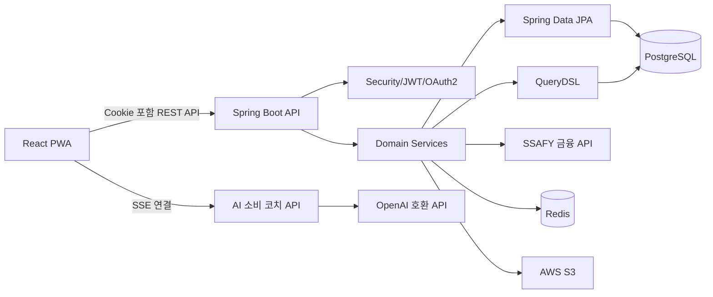
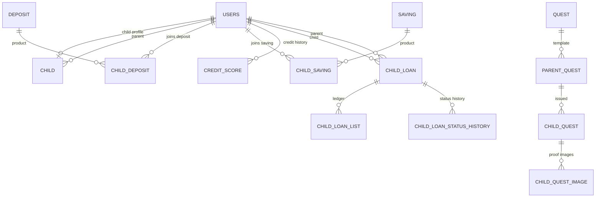
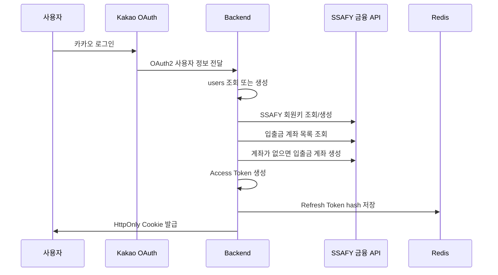
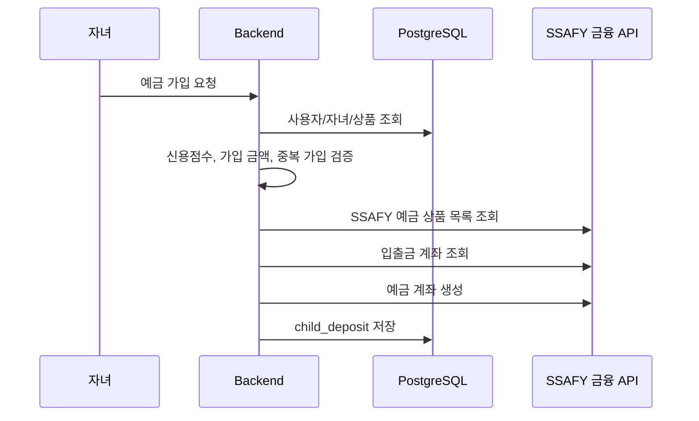
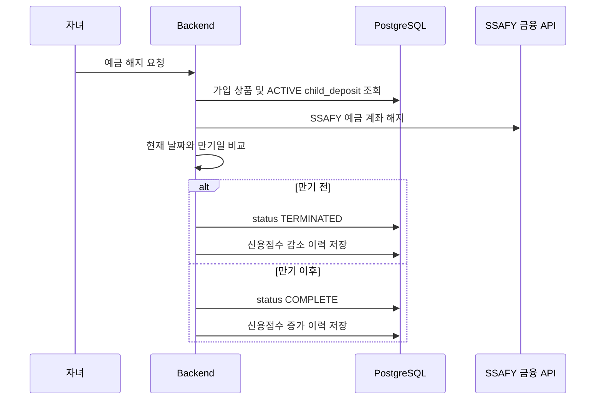
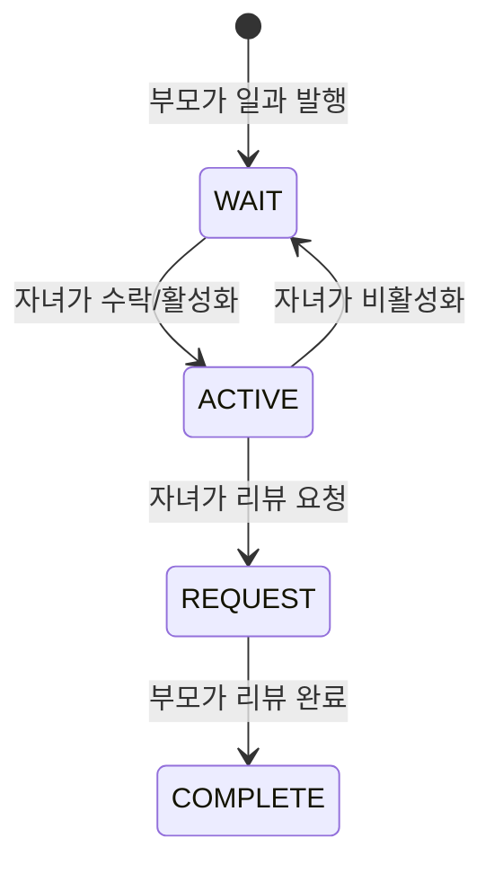
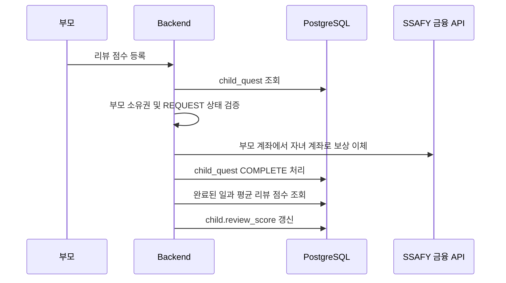
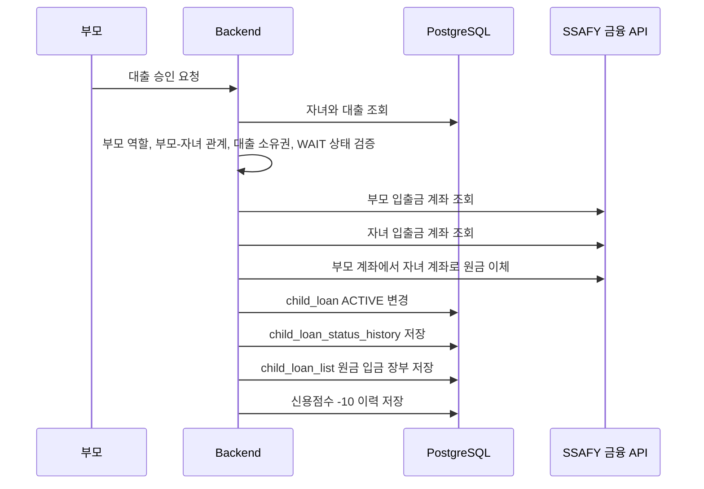
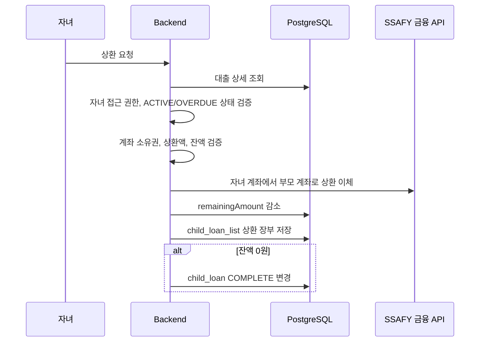
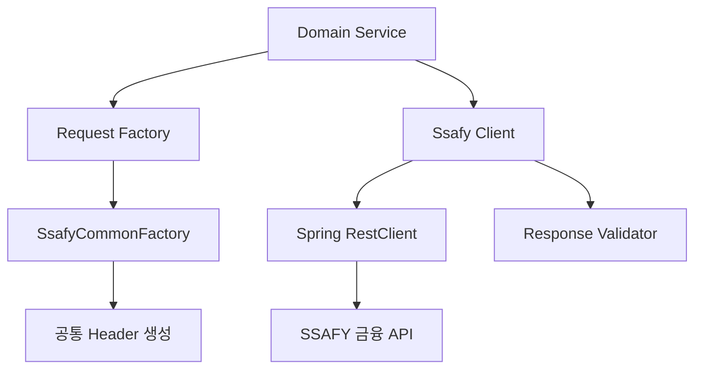

# 용돈농장 Backend 포트폴리오 정리

> 청소년이 용돈, 저축, 대출, 상환, 신용점수 변화를 실제 금융 흐름처럼 경험할 수 있도록 만든 부모-자녀 금융 교육 플랫폼입니다.  
> 저는 이 프로젝트에서 Backend 개발을 담당하며 DB 설계, 전체 CRUD API 구현, QueryDSL 기반 조회 API, 외부 금융 API 연동, 인증/인가 흐름, 도메인 비즈니스 로직을 구현했습니다.

## 1. 프로젝트 개요

| 항목 | 내용 |
| --- | --- |
| 프로젝트명 | 용돈농장 |
| 서비스 유형 | 청소년 금융 교육 및 용돈 관리 플랫폼 |
| 핵심 사용자 | 부모, 자녀 |
| Backend 역할 | DB 설계, REST API 구현, QueryDSL 조회 최적화, 금융 API 연동, 인증/인가, 도메인 로직 구현 |
| 주요 도메인 | 사용자/자녀, 입출금 계좌, 예금, 적금, 곳간, 일과, 대출, 신용점수, AI 소비 코치, 이미지 업로드 |
| Backend 기술 | Java 21, Spring Boot 3.5.11, Spring Data JPA, QueryDSL 6.10.1, Spring Security, OAuth2, JWT, Redis, PostgreSQL, Spring AI, AWS S3 |
| 외부 연동 | Kakao OAuth, SSAFY 금융망 API, OpenAI 호환 API, AWS S3/CDN |
| 배포/운영 | Docker, Docker Compose, Jenkins, EC2, Docker Hub |

### 한 줄 소개

용돈농장은 청소년이 단순히 용돈을 받는 것을 넘어, 예금/적금 가입, 대출 신청과 상환, 일과 보상, 신용점수 변화를 경험하며 금융 의사결정의 책임을 배울 수 있는 서비스입니다.

### 문제 정의

청소년은 이미 간편결제, 계좌이체, 온라인 소비를 통해 실전 금융 소비자가 되었지만, 금융 이해력과 책임 있는 소비 경험은 충분하지 않습니다. 용돈농장은 부모가 관리하는 안전한 환경 안에서 자녀가 실제 돈의 흐름을 경험하고, 금융 행동의 결과가 신용점수와 자산 변화로 이어지도록 설계했습니다.

### Backend 관점의 핵심 목표

| 목표 | 구현 방향 |
| --- | --- |
| 실제 금융 흐름 구현 | SSAFY 금융 API를 활용해 계좌 생성, 이체, 예금/적금 가입, 해지, 거래 내역 조회 구현 |
| 부모-자녀 권한 분리 | 역할 기반 API 접근 제어와 부모-자녀 소유권 검증 |
| 금융 상품 탐색 편의성 | QueryDSL로 가입 가능 상품 우선 정렬, 커서 기반 페이지네이션, 중복 가입 제외 |
| 신용점수 이력화 | 예금/적금 완료/해지, 대출 승인 이벤트를 신용점수 변경 이력으로 기록 |
| 대출 책임 경험 | 부모 승인형 대출, 원금 입금, 상환 장부, 잔액 감소, 완료 상태 전환 구현 |
| 확장 가능한 도메인 구조 | Controller, Service, Repository, Reader, Factory, Client 계층 분리 |

## 2. 나의 Backend 담당 범위

### 주요 기여 요약

- 프로젝트 전체 CRUD API를 설계하고 구현했습니다.
- PostgreSQL 기반 핵심 도메인 테이블을 설계했습니다.
- Spring Data JPA와 QueryDSL을 함께 사용해 단순 CRUD와 복잡 조회를 분리했습니다.
- 사용자, 부모, 자녀, 예금, 적금, 일과, 대출, 신용점수, 이미지 업로드, AI 코치 API를 구현했습니다.
- SSAFY 금융망 API를 추상화해 입출금, 예금, 적금, 송금 기능을 서비스 도메인과 연결했습니다.
- 카카오 OAuth2 로그인 이후 JWT, Redis Refresh Token, HttpOnly Cookie 기반 인증 흐름을 구현했습니다.
- 대출 승인/상환, 일과 보상, 예적금 가입/해지처럼 금융 이벤트가 여러 테이블과 외부 API에 걸쳐 처리되는 로직을 트랜잭션 단위로 구성했습니다.
- QueryDSL을 활용해 상품 목록, 신용점수 이력, 자녀 상세 대시보드, 대출 거래 내역 등 복합 조회 API를 구현했습니다.

### 코드 규모 기준

| 구분 | 수치 |
| --- | ---: |
| REST Controller | 25개 |
| API Mapping | 62개 |
| QueryDSL Custom Repository Impl | 9개 |
| Entity/Enum 관련 Java 파일 | 28개 |
| 핵심 DB 테이블 | 16개 |

> 위 수치는 현재 코드 기준으로 산출했습니다.

## 3. Backend 기술 스택

### Language & Framework

| 기술 | 사용 목적 |
| --- | --- |
| Java 21 | 백엔드 애플리케이션 구현 |
| Spring Boot 3.5.11 | REST API 서버 구현 |
| Spring MVC | Controller 기반 HTTP API 구성 |
| Spring Validation | 요청 DTO 유효성 검증 |
| Spring Security | 인증/인가, OAuth2, JWT 필터 |

### Persistence

| 기술 | 사용 목적 |
| --- | --- |
| Spring Data JPA | 기본 CRUD Repository 구현 |
| QueryDSL 6.10.1 | 복잡한 동적 조회, 커서 페이지네이션, 집계/서브쿼리 |
| PostgreSQL 15 | 서비스 핵심 데이터 저장 |
| JPA Auditing | 생성일/수정일 공통 관리 |

### Infra & External

| 기술 | 사용 목적 |
| --- | --- |
| Redis | Refresh Token 저장, AI 결과 캐싱, 중복 AI 호출 방지 락 |
| Kakao OAuth2 | 소셜 로그인 |
| JWT | Access Token 발급 및 인증 |
| SSAFY 금융 API | 회원키, 계좌, 송금, 예금, 적금, 거래 내역 |
| Spring AI OpenAI | AI 소비 코치 |
| Server-Sent Events | AI 응답 스트리밍 |
| AWS S3 Presigned URL | 이미지 직접 업로드 |
| Docker/Jenkins | 빌드 및 배포 자동화 |

## 4. Backend 아키텍처



### 계층 구조

| 계층 | 역할 |
| --- | --- |
| Controller | HTTP 요청/응답 처리, 인증 사용자 주입, 요청 DTO 검증 |
| Service | 도메인 정책, 트랜잭션, 외부 API 호출 순서, 상태 변경 |
| Repository | JPA 기반 CRUD와 QueryDSL 기반 복잡 조회 |
| Reader | 특정 외부 API 또는 내부 조회를 재사용 가능한 읽기 작업으로 분리 |
| Factory | SSAFY 금융 API 요청 Header/Body 생성 책임 분리 |
| Client | RestClient 기반 외부 API 호출, 응답 검증, 오류 파싱 |
| Entity | 도메인 상태와 상태 변경 메서드 캡슐화 |

### 패키지 구조

```text
site.yongdonfarm
├─ ai                # AI 소비 분석, SSE, Redis 캐시/락
├─ common            # 공통 응답, 예외, 설정, BaseEntity
├─ credit            # 신용점수 이력 및 점수 반영
├─ demand_deposit    # 입출금 계좌, 송금, 거래 내역
├─ deposit           # 예금 상품/가입/해지/내역
├─ external/ssafy    # SSAFY 금융 API Client, RequestFactory, DTO
├─ loan              # 부모 승인 대출, 상환, 거래 장부
├─ parent            # 부모 홈, 용돈, 곳간, 대출 금리 설정
├─ quest             # 일과 템플릿, 발행, 수행, 리뷰
├─ s3                # 이미지 Presigned URL
├─ saving            # 적금 상품/가입/해지/내역
├─ security          # OAuth2, JWT, Cookie, Refresh Token
└─ user              # 사용자, 자녀, 역할, 자산 조회
```

## 5. DB 설계

### 설계 방향

용돈농장의 DB는 단순 게시판형 CRUD가 아니라 금융 이벤트의 상태와 이력을 안정적으로 남기는 구조가 필요했습니다. 그래서 상품 마스터, 사용자 가입 내역, 거래 장부, 상태 이력, 신용점수 이력을 분리했습니다.

### 핵심 설계 원칙

| 원칙 | 적용 내용 |
| --- | --- |
| 사용자 역할 분리 | `users`에는 공통 로그인 정보를 저장하고, 자녀 전용 정보는 `child`에 분리 |
| 부모-자녀 관계 명시 | `child.parent_id`로 부모 사용자를 연결 |
| 상품 마스터와 가입 내역 분리 | `deposit`, `saving`은 상품 정보, `child_deposit`, `child_saving`은 가입 상태 |
| 발행 시점 정보 보존 | `parent_quest`, `child_quest`에 제목/내용/보상 스냅샷 저장 |
| 금융 상태 이력화 | 예금/적금/대출 상태 변경 이력 테이블 구성 |
| 대출 장부 분리 | `child_loan`은 대출 상태, `child_loan_list`는 원금 입금/상환 거래 장부 |
| 신용 이벤트 기록 | `credit_score`에 변경 전 점수, 변경량, 이벤트 타입, 이벤트 ID 저장 |

### 주요 테이블

| 테이블 | 역할 | 주요 컬럼 |
| --- | --- | --- |
| `users` | 카카오 로그인 사용자 및 인증 정보 | `user_id`, `social_id`, `email`, `nickname`, `user_key`, `role`, `pin` |
| `child` | 자녀 전용 정보 | `child_id`, `parent_id`, `amount`, `payment_day`, `credit_score`, `review_score`, `loan_rate` |
| `deposit` | 예금 상품 마스터 | `deposit_id`, `name`, `rate`, `period`, `min_amount`, `max_amount`, `min_credit_score`, `terms`, `increase`, `decrease` |
| `child_deposit` | 자녀 예금 가입 내역 | `child_deposit_id`, `child_id`, `deposit_id`, `start_date`, `end_date`, `status`, `sign_image_url`, `reward_item` |
| `saving` | 적금 상품 마스터 | `saving_id`, `name`, `rate`, `period`, `min_amount`, `max_amount`, `min_credit_score`, `terms`, `increase`, `decrease` |
| `child_saving` | 자녀 적금 가입 내역 | `child_saving_id`, `child_id`, `saving_id`, `start_date`, `end_date`, `status`, `sign_image_url`, `reward_item` |
| `quest` | 기본 일과 템플릿 | `quest_id`, `name`, `category`, `reward` |
| `parent_quest` | 부모가 자녀별로 만든 일과 | `parent_quest_id`, `parent_id`, `child_id`, `quest_id`, `name`, `content`, `category`, `reward` |
| `child_quest` | 자녀에게 발행된 실제 일과 | `child_quest_id`, `child_id`, `parent_quest_id`, `status`, `review`, `complete_time` |
| `child_quest_image` | 일과 인증 이미지 | `child_quest_image_id`, `child_quest_id`, `image_url` |
| `child_loan` | 자녀 대출 | `child_loan_id`, `parent_id`, `child_id`, `principal_amount`, `remaining_amount`, `rate`, `status`, `sign_image_url` |
| `child_loan_list` | 대출 거래 장부 | `child_loan_list_id`, `child_loan_id`, `amount`, `remaining_amount`, `trade_at` |
| `child_loan_status_history` | 대출 상태 이력 | `child_loan_status_history_id`, `child_loan_id`, `curr_status` |
| `credit_score` | 신용점수 변경 이력 | `credit_score_id`, `child_id`, `change_type`, `score_delta`, `before_score`, `event_type`, `event_id` |

### ERD 개념도



### 도메인 상태값

| 도메인 | 상태값 | 의미 |
| --- | --- | --- |
| 예금/적금 | `ACTIVE` | 가입 중 |
| 예금/적금 | `TERMINATED` | 중도 해지 |
| 예금/적금 | `COMPLETE` | 만기 완료 |
| 일과 | `WAIT` | 발행 후 대기 |
| 일과 | `ACTIVE` | 자녀가 수행 중 |
| 일과 | `REQUEST` | 자녀가 리뷰 요청 |
| 일과 | `COMPLETE` | 부모 리뷰 완료 및 보상 지급 |
| 대출 | `WAIT` | 자녀 신청 후 승인 대기 |
| 대출 | `ACTIVE` | 승인되어 상환 중 |
| 대출 | `OVERDUE` | 연체 상태 확장용 |
| 대출 | `COMPLETE` | 전액 상환 완료 |
| 신용점수 | `INCREASE` | 점수 증가 |
| 신용점수 | `DECREASE` | 점수 감소 |

## 6. QueryDSL 활용

### QueryDSL을 사용한 이유

기본 CRUD는 Spring Data JPA로 충분하지만, 용돈농장에는 다음과 같은 복잡 조회가 많았습니다.

- 자녀 신용점수 기준으로 가입 가능한 상품을 우선 정렬해야 함
- 이미 가입 중인 상품은 목록에서 제외해야 함
- 상품 목록을 커서 기반으로 페이지네이션해야 함
- 부모 대시보드에서 대출 잔액 합계, 대기 대출 수, 리뷰 요청 수를 한 번에 조회해야 함
- 신용점수 이력을 생성일과 ID 기준으로 안정적으로 페이지네이션해야 함
- 대출 거래 내역을 기간, 입출금 타입, 정렬 조건으로 동적 조회해야 함

이 요구사항을 메서드 이름 기반 쿼리로 처리하면 Repository 메서드가 과도하게 늘어나고, JPQL 문자열은 타입 안정성이 떨어집니다. 그래서 QueryDSL을 도입해 조건 조합, 서브쿼리, DTO Projection, 동적 정렬을 명확하게 구현했습니다.

### QueryDSL 설정

`JPAQueryFactory`를 Bean으로 등록해 각 Custom Repository에서 주입받아 사용했습니다.

```java
@Configuration
public class QuerydslConfig {

    @PersistenceContext
    private EntityManager entityManager;

    @Bean
    public JPAQueryFactory jpaQueryFactory() {
        return new JPAQueryFactory(entityManager);
    }
}
```

관련 코드: `common/config/QuerydslConfig.java`

### 적용 사례 1. 예금/적금 상품 목록 조회

예금/적금 목록은 단순히 전체 상품을 보여주는 것이 아니라 자녀의 신용점수를 기준으로 가입 가능 여부를 계산하고, 가입 가능 상품을 먼저 보여줘야 했습니다. 또한 같은 상품을 이미 `ACTIVE` 상태로 가입한 경우 목록에서 제외했습니다.

구현 포인트:

| 요구사항 | QueryDSL 구현 |
| --- | --- |
| 가입 가능 여부 계산 | `deposit.minCreditScore <= child.creditScore` 서브쿼리 |
| 가입 가능 상품 우선 정렬 | `CaseBuilder`로 available true 우선 |
| 중복 가입 제외 | `not exists` 서브쿼리로 active 가입 내역 제외 |
| 커서 페이지네이션 | `available:productId` 형태 커서 사용 |
| DTO 직접 조회 | `Projections.constructor` 사용 |

예금 상품 조회 조건:

```java
.where(
    cursorCondition(userId, availableCursor, productIdCursor),
    notExistsActiveChildDeposit(userId)
)
.orderBy(
    new CaseBuilder()
        .when(isAvailable(userId)).then(1)
        .otherwise(0)
        .desc(),
    deposit.id.desc()
)
.limit(size + 1L)
```

성과:

- 가입 가능 상품과 불가능 상품을 API 응답에서 함께 제공했습니다.
- 프론트엔드는 `available` 값만 보고 버튼 활성/비활성을 결정할 수 있게 되었습니다.
- offset 페이지네이션보다 데이터 추가/삭제에 강한 커서 구조를 적용했습니다.

관련 코드:

- `deposit/repository/DepositRepositoryImpl.java`
- `saving/repository/SavingRepositoryImpl.java`

### 적용 사례 2. 신용점수 이력 커서 페이지네이션

신용점수 이력은 최신순으로 계속 추가되는 데이터입니다. 단순 `createdAt` 기준만 사용하면 같은 시간에 생성된 데이터 순서가 흔들릴 수 있어 `createdAt + id` 복합 커서를 사용했습니다.

구현 포인트:

```java
return creditScore.createdAt.lt(cursorCreatedAt)
    .or(
        creditScore.createdAt.eq(cursorCreatedAt)
            .and(creditScore.id.lt(cursorId))
    );
```

성과:

- 최신순 무한 스크롤에 적합한 안정적 페이지네이션을 구현했습니다.
- 같은 생성 시각의 이력도 ID 기준으로 누락/중복 없이 조회할 수 있습니다.

관련 코드:

- `credit/repository/CreditScoreRepositoryImpl.java`

### 적용 사례 3. 대출 거래 내역 동적 검색

대출 거래 내역은 기간, 금액 타입, 정렬 조건을 조합해야 했습니다.

구현 포인트:

| 검색 조건 | 처리 방식 |
| --- | --- |
| 대출 ID | `childLoan.id.eq(...)` |
| 기간 | `tradeAt.between(start, end)` |
| 금액 타입 | `ALL`, `POSITIVE`, `NEGATIVE` 조건 분기 |
| 정렬 | 최신순/과거순에 따라 `OrderSpecifier` 동적 생성 |
| N+1 방지 | `childLoan` fetch join |

성과:

- 자녀와 부모가 같은 대출 장부를 서로 다른 관점으로 조회할 수 있게 했습니다.
- 상환액과 대출금 입금을 장부 형태로 일관되게 표현했습니다.

관련 코드:

- `loan/repository/ChildLoanListRepositoryImpl.java`

### 적용 사례 4. 부모 자녀 상세 대시보드

부모 홈에서 자녀 상세를 조회할 때 여러 값을 한 번에 내려야 했습니다.

필요한 값:

- 자녀 닉네임
- 정기 용돈 금액
- 활성 대출 잔액 합계
- 신용점수
- 승인 대기 대출 수
- 리뷰 요청 일과 수

구현 포인트:

- QueryDSL `Projections.constructor`로 DTO 직접 조회
- `JPAExpressions`로 대출 잔액 합계, 대기 대출 수, 리뷰 요청 수를 서브쿼리 조회
- `coalesce(sum(...), 0)`로 대출이 없는 경우 0 반환

성과:

- 부모 홈 화면에 필요한 복합 데이터를 하나의 응답 DTO로 구성했습니다.
- 여러 Repository 호출을 줄이고 조회 목적이 명확한 쿼리를 구성했습니다.

관련 코드:

- `user/repository/ChildRepositoryImpl.java`

### 적용 사례 5. 일과 리뷰 평균 평점

부모가 일과 리뷰 점수를 등록하면 자녀의 평균 평점을 갱신해야 했습니다.

구현 포인트:

```java
Double averageReviewScore = queryFactory
    .select(childQuest.review.avg())
    .from(childQuest)
    .where(
        childQuest.child.id.eq(childId),
        childQuest.status.eq(QuestStatus.COMPLETE),
        childQuest.review.isNotNull()
    )
    .fetchOne();
```

성과:

- 완료된 일과만 평균 계산에 반영했습니다.
- 자녀 평점은 `BigDecimal`로 소수 1자리 반올림 처리했습니다.

관련 코드:

- `quest/repository/ChildQuestRepositoryImpl.java`
- `quest/service/ParentQuestReviewService.java`

## 7. API 설계 및 구현

### API 설계 원칙

| 원칙 | 적용 방식 |
| --- | --- |
| 역할 기반 경로 분리 | 부모 API는 `/parents/**`, 자녀 API는 `/children/**`, 공통 API는 도메인 기준 |
| 상태 변경은 명확한 Command API | 대출 승인, 상환, 일과 리뷰, 예적금 해지 등을 명확한 endpoint로 분리 |
| 응답 형태 통일 | `ResponseBody<T>`로 `statusCode`, `message`, `data`, `errorCode` 구조 제공 |
| 예외 코드 기반 실패 응답 | `GlobalException`, `ErrorCode`, `GlobalExceptionHandler`로 도메인 오류 관리 |
| 외부 API 추상화 | Controller/Service가 SSAFY API 세부 path를 직접 알지 않도록 Client/Factory 분리 |
| 인증 사용자 기반 처리 | JWT에서 `userId`, `userKey`, `role`을 추출해 서비스 로직에 전달 |

### 공통 응답 구조

```json
{
  "statusCode": 200,
  "message": "요청이 성공했습니다.",
  "data": {},
  "errorCode": null
}
```

### 주요 API 목록

#### 인증/사용자

| Method | Path | 설명 |
| --- | --- | --- |
| POST | `/users/reissue` | Access/Refresh Token 재발급 |
| POST | `/users/logout` | 로그아웃 및 쿠키 삭제 |
| POST | `/users/pin` | PIN 설정 |
| POST | `/users/pin/check` | PIN 확인 |
| POST | `/users/role` | 사용자 역할 설정 |
| POST | `/users/parent-email` | 학생이 부모 이메일로 연결 |
| GET | `/child` | 학생 홈 데이터 조회 |
| GET | `/users/assets` | 학생 전체 자산 조회 |

#### 부모

| Method | Path | 설명 |
| --- | --- | --- |
| GET | `/parents/me` | 부모 프로필과 연결 자녀 목록 |
| GET | `/parents/children/{childId}` | 부모가 보는 자녀 상세 |
| GET | `/parents/children/{childId}/money` | 정기 용돈 설정 조회 |
| POST | `/parents/children/{childId}/money` | 정기 용돈 설정 |
| POST | `/parents/children/{childId}/money/search` | 용돈 지급 이력 조회 |
| GET | `/parents/children/{childId}/granary` | 자녀 곳간 조회 |
| PUT | `/parents/children/{childId}/granary/rewards` | 곳간 보상 설정 |
| DELETE | `/parents/children/{childId}/granary/rewards` | 곳간 보상 삭제 |

#### 계좌/송금

| Method | Path | 설명 |
| --- | --- | --- |
| POST | `/accounts/balance` | 입출금 계좌 잔액 조회 |
| POST | `/accounts/holder-name` | 예금주명 조회 |
| POST | `/transfers` | 일반 계좌 이체 |
| POST | `/demandeposit/transactions/search` | 입출금 거래 내역 조회 |

#### 예금

| Method | Path | 설명 |
| --- | --- | --- |
| GET | `/deposits` | 예금 상품 목록 |
| GET | `/deposits/products/{productId}` | 예금 상품 상세 |
| GET | `/deposits/products/{productId}/terms` | 예금 상품 약관 |
| POST | `/deposits` | 예금 가입 |
| POST | `/deposits/terminate` | 예금 해지 |
| GET | `/deposits/terms/{depositId}` | 가입한 예금 약관/서명 |
| GET | `/deposits/{depositId}/transactions/search` | 가입한 예금 거래 내역 |

#### 적금

| Method | Path | 설명 |
| --- | --- | --- |
| GET | `/savings` | 적금 상품 목록 |
| GET | `/savings/products/{productId}` | 적금 상품 상세 |
| GET | `/savings/products/{productId}/terms` | 적금 상품 약관 |
| POST | `/savings` | 적금 가입 |
| POST | `/savings/terminate` | 적금 해지 |
| GET | `/savings/terms/{savingId}` | 가입한 적금 약관/서명 |
| POST | `/savings/{savingId}/transactions/search` | 가입한 적금 거래 내역 |

#### 일과

| Method | Path | 설명 |
| --- | --- | --- |
| GET | `/parents/quest-templates` | 기본 일과 템플릿 조회 |
| GET | `/parents/children/{childId}/quest` | 부모가 보는 자녀 일과 메인 |
| POST | `/parents/{childId}/quest/create` | 부모 커스텀 일과 생성 |
| POST | `/parents/children/{childId}/quest-templates/{questId}` | 기본 템플릿으로 부모 일과 생성 |
| GET | `/parents/quest/{parentQuestId}` | 부모 일과 상세 |
| PUT | `/parents/quest/{parentQuestId}` | 부모 일과 수정 |
| DELETE | `/parents/quest/{parentQuestId}` | 부모 일과 삭제 |
| POST | `/parents/quest/{parentQuestId}/issue` | 자녀에게 일과 발행 |
| DELETE | `/parents/issue/{childQuestId}` | 발행된 대기 일과 취소 |
| GET | `/parents/issue/{childQuestId}` | 리뷰 요청 일과 상세 |
| POST | `/parents/issue/{childQuestId}/review` | 부모 리뷰 및 보상 지급 |
| GET | `/children/parent-quests` | 자녀가 보는 일과 목록 |
| PATCH | `/children/quest/{childQuestId}` | 자녀 일과 상태 변경 |
| POST | `/children/quest/{childQuestId}/review` | 자녀 리뷰 요청 |

#### 대출

| Method | Path | 설명 |
| --- | --- | --- |
| GET | `/loans/interestrate` | 자녀가 보는 현재 대출 금리 |
| POST | `/loans` | 자녀 대출 신청 |
| GET | `/loans/{userLoanId}` | 대출 상세 및 상환 계좌 정보 |
| POST | `/transfers/{userLoanId}/loans` | 자녀 대출 상환 |
| GET | `/parents/children/{childId}/loans` | 부모가 보는 자녀 대출 목록 |
| GET | `/parents/children/{childId}/loans/rate` | 부모가 보는 자녀 대출 금리 |
| PATCH | `/parents/children/{childId}/loans/rate` | 부모 대출 금리 설정 |
| POST | `/parents/children/{childId}/loans/approve` | 부모 대출 승인 |
| POST | `/loans/{userLoanId}/transactions/search` | 자녀 대출 거래 내역 |
| POST | `/parents/children/{childId}/loans/{userLoanId}/search` | 부모 대출 거래 내역 |

#### 신용/AI/이미지

| Method | Path | 설명 |
| --- | --- | --- |
| GET | `/credit` | 자녀 본인 신용 이력 |
| GET | `/parents/children/{childId}/credit` | 부모가 보는 자녀 신용 이력 |
| GET | `/ai-chat/stream` | AI 소비 코치 SSE |
| POST | `/images/presigned-url` | S3 업로드용 Presigned URL 발급 |

## 8. 도메인별 구현 상세

### 8.1 사용자 및 인증

#### 기능

- 카카오 OAuth2 로그인
- 신규 사용자는 `ROLE_GUEST`로 생성
- SSAFY 금융 API 회원키 조회/생성
- 입출금 계좌 자동 개설
- PIN 설정 및 확인
- 부모/자녀 역할 선택
- 자녀가 부모 이메일로 연결
- Access Token, Refresh Token 재발급
- 로그아웃 시 Refresh Token 및 Cookie 삭제

#### 구현 흐름



#### Backend 설계 포인트

| 포인트 | 설명 |
| --- | --- |
| `social_id` unique | 카카오 계정 기준 사용자 중복 생성 방지 |
| `user_key` unique | SSAFY 금융 API 회원키 저장 |
| Refresh Token hash 저장 | 원문 Refresh Token을 Redis에 저장하지 않고 SHA-256 hash로 저장 |
| Refresh Token Rotation | 재발급 시 기존 Refresh Token 삭제 후 새 Refresh Token 저장 |
| 역할 변경 후 재발급 | 역할 선택 이후 Access Token에 최신 role 반영 |
| Cookie 기반 인증 | HttpOnly Cookie로 브라우저 JavaScript 접근을 제한 |

관련 코드:

- `user/service/UserService.java`
- `security/service/AuthService.java`
- `security/jwt/TokenProvider.java`
- `security/jwt/JwtAuthenticationFilter.java`
- `security/handler/CustomLoginSuccessHandler.java`

### 8.2 입출금 계좌 및 송금

#### 기능

- 입출금 계좌 잔액 조회
- 예금주명 조회
- 계좌 거래 내역 조회
- 일반 송금
- 대출 승인 송금
- 대출 상환 송금
- 일과 보상 송금
- 용돈 지급 이력 조회

#### 구현 포인트

| 포인트 | 설명 |
| --- | --- |
| 출금 계좌 소유권 검증 | 로그인 사용자의 `userKey`로 계좌 목록을 조회해 출금 계좌가 본인 소유인지 확인 |
| 동일 계좌 송금 차단 | 출금 계좌와 입금 계좌가 같으면 예외 처리 |
| 송금 메모 타입 분리 | `ALLOWANCE`, `QUEST_REWARD`, `LOAN_DEPOSIT`, `LOAN_WITHDRAW`, `LOAN_REPAYMENT` |
| AI 캐시 무효화 | 자녀 거래가 발생하면 당일 AI 소비 코치 캐시 삭제 |
| 외부 API 요청 Factory 분리 | SSAFY Header 생성과 API별 Body 생성을 Factory에서 담당 |

관련 코드:

- `demand_deposit/service/TransferService.java`
- `demand_deposit/service/DemandDepositTransactionSearchService.java`
- `demand_deposit/reader/DemandDepositAccountOwnershipReader.java`
- `external/ssafy/client/SsafyDemandDepositClient.java`
- `external/ssafy/factory/SsafyDemandDepositRequestFactory.java`

### 8.3 예금

#### 기능

- 예금 상품 목록 조회
- 예금 상품 상세 조회
- 예금 상품 약관 조회
- 예금 가입
- 가입한 예금 약관 및 서명 조회
- 예금 거래 내역 조회
- 예금 해지
- 만기/중도 해지에 따른 신용점수 반영

#### 가입 조건

| 조건 | 처리 |
| --- | --- |
| 신용점수 | 자녀 신용점수가 상품의 `minCreditScore` 이상이어야 가입 가능 |
| 가입 금액 | `minAmount` 이상, `maxAmount` 이하 |
| 중복 가입 | 같은 상품을 `ACTIVE` 상태로 이미 가입 중이면 차단 |
| 외부 상품 매칭 | 내부 상품명과 SSAFY 예금 상품명을 매칭 |
| 서명 이미지 | 가입 시 `signImageUrl` 저장 |

#### 가입 흐름



#### 해지 흐름



관련 코드:

- `deposit/service/DepositService.java`
- `deposit/repository/DepositRepositoryImpl.java`
- `deposit/entity/Deposit.java`
- `deposit/entity/ChildDeposit.java`

### 8.4 적금

#### 기능

- 적금 상품 목록 조회
- 적금 상품 상세 조회
- 적금 상품 약관 조회
- 적금 가입
- 가입한 적금 약관 및 서명 조회
- 적금 납입 내역 조회
- 적금 해지
- 만기/중도 해지에 따른 신용점수 반영

#### 예금과 다른 점

| 항목 | 예금 | 적금 |
| --- | --- | --- |
| 입금 방식 | 가입 시 일시 납입 | 매일 자동 납입 성격 |
| 거래 내역 | 단일 납입 내역 중심 | 날짜별 납입 내역 가공 |
| 거래 내역 필터 | 가입 계좌 납입 내역 조회 | 기간, 입출금 타입, 정렬 조건 적용 |

#### 적금 거래 내역 가공

SSAFY 적금 납입 내역을 그대로 반환하지 않고, 서비스 화면에 맞는 거래 내역으로 변환했습니다.

구현 내용:

- `paymentDate + paymentTime`을 `LocalDateTime`으로 파싱
- 요청 기간 안에 있는 납입 내역만 필터링
- 거래 타입 `ALL`, `DEPOSIT`, `WITHDRAW`에 따라 필터링
- 최신순/과거순 정렬 지원
- 누적 잔액 `runningBalance` 계산
- 실패 사유가 있으면 설명 문구에 반영

관련 코드:

- `saving/service/SavingsService.java`
- `saving/repository/SavingRepositoryImpl.java`
- `saving/entity/Saving.java`
- `saving/entity/ChildSaving.java`

### 8.5 곳간

곳간은 자녀가 가입한 예금/적금 자산을 농장 콘셉트에 맞게 보여주는 영역입니다.

#### 기능

- 부모가 자녀의 활성 예금/적금 조회
- 실제 계좌 잔액 및 금리 조회
- 예금/적금 보상 문구 등록
- 예금/적금 보상 문구 삭제

#### 구현 포인트

| 포인트 | 설명 |
| --- | --- |
| 내부 가입 정보와 외부 계좌 결합 | 내부 `child_deposit`, `child_saving`과 SSAFY 계좌 목록을 상품명 기준으로 매칭 |
| 부모 권한 검증 | 요청한 부모가 해당 자녀의 부모인지 확인 |
| 보상 문구 저장 | 가입 내역 테이블의 `reward_item`에 저장 |
| 도메인 타입 분리 | `GranaryType`으로 예금/적금 구분 |

관련 코드:

- `parent/service/GranaryService.java`
- `parent/controller/GranaryController.java`
- `parent/enums/GranaryType.java`

### 8.6 일과

일과는 부모가 자녀에게 미션을 부여하고, 자녀가 수행 인증 후 부모가 리뷰하면 보상이 지급되는 기능입니다.

#### 기능

- 기본 일과 템플릿 조회
- 부모가 템플릿 기반 일과 생성
- 부모가 커스텀 일과 생성
- 부모 일과 상세 조회
- 부모 일과 수정
- 부모 일과 삭제
- 자녀에게 일과 발행
- 발행된 대기 일과 취소
- 자녀가 일과 활성화/대기 전환
- 자녀가 인증 이미지와 함께 리뷰 요청
- 부모가 리뷰 점수 등록
- 보상 금액 이체
- 자녀 평균 평점 갱신

#### 상태 흐름



#### 리뷰 완료 흐름



#### 설계 포인트

| 포인트 | 설명 |
| --- | --- |
| 템플릿과 발행 분리 | `quest`, `parent_quest`, `child_quest`를 분리해 템플릿-부모설정-실제발행 단계 표현 |
| 발행 시점 스냅샷 | `child_quest`에 제목, 내용, 카테고리, 보상을 복사해 나중에 템플릿이 바뀌어도 발행 당시 정보 보존 |
| 인증 이미지 분리 | `child_quest_image`를 별도 테이블로 분리해 다중 이미지 확장 가능 |
| 보상 지급과 리뷰 완료 결합 | 부모 리뷰 완료 시 실제 계좌 이체 후 상태 변경 |
| 평균 평점 계산 | QueryDSL `avg()`로 완료된 일과의 리뷰 점수만 반영 |

관련 코드:

- `quest/service/ParentQuestTemplateCommandService.java`
- `quest/service/ParentQuestCustomCommandService.java`
- `quest/service/ParentQuestIssueService.java`
- `quest/service/ChildQuestCommandService.java`
- `quest/service/ParentQuestReviewService.java`
- `quest/repository/ChildQuestRepositoryImpl.java`

### 8.7 대출

대출은 부모가 승인하는 마이너스 통장 콘셉트로 구현했습니다. 자녀가 신청하고, 부모가 승인하면 실제 송금이 일어나며, 이후 자녀가 상환할 수 있습니다.

#### 기능

- 부모가 자녀 대출 금리 설정
- 자녀가 대출 신청
- 자녀가 현재 금리 조회
- 부모가 대출 목록 조회
- 부모가 대출 승인
- 자녀가 대출 상세 조회
- 자녀가 대출 상환
- 자녀/부모가 대출 거래 내역 조회

#### 대출 신청 데이터

| 필드 | 의미 |
| --- | --- |
| `name` | 대출명 |
| `principalAmount` | 원금 |
| `rate` | 부모가 설정한 금리 |
| `remainingAmount` | 남은 상환 금액 |
| `status` | `WAIT`, `ACTIVE`, `OVERDUE`, `COMPLETE` |
| `signImageUrl` | 자녀 서명 이미지 |

#### 대출 승인 흐름



#### 대출 상환 흐름



#### 설계 포인트

| 포인트 | 설명 |
| --- | --- |
| 승인 전후 상태 분리 | 신청 직후 `WAIT`, 승인 후 `ACTIVE` |
| 실거래와 내부 장부 연결 | SSAFY 이체 성공 후 `child_loan_list`에 원금 또는 상환 기록 |
| 금액 부호로 거래 구분 | 대출 원금은 양수, 상환은 음수 |
| 신용점수 영향 | 대출 승인 시 신용점수 10점 감소 |
| 접근 제어 | 부모는 연결된 자녀의 대출만 승인 가능, 자녀는 본인 대출만 상환 가능 |
| 잔액 검증 | 상환액이 남은 금액보다 크면 차단 |

관련 코드:

- `loan/service/LoanService.java`
- `loan/service/LoanApproveService.java`
- `loan/service/LoanRepaymentTransferService.java`
- `loan/repository/ChildLoanRepositoryImpl.java`
- `loan/repository/ChildLoanListRepositoryImpl.java`
- `loan/entity/ChildLoan.java`
- `loan/entity/ChildLoanList.java`

### 8.8 신용점수

신용점수는 자녀의 금융 행동 결과를 수치화하는 핵심 지표입니다.

#### 신용점수 반영 이벤트

| 이벤트 | 점수 변화 |
| --- | --- |
| 예금 만기 완료 | 상품별 증가 점수 |
| 예금 중도 해지 | 상품별 감소 점수 |
| 적금 만기 완료 | 상품별 증가 점수 |
| 적금 중도 해지 | 상품별 감소 점수 |
| 대출 승인 | -10 |

#### 구현 포인트

| 포인트 | 설명 |
| --- | --- |
| 점수 범위 제한 | 0점 미만, 1000점 초과 방지 |
| 변경 이력 저장 | 변경 전 점수, 실제 반영 delta, 이벤트 타입, 이벤트 ID 저장 |
| 이벤트 추적 가능 | `event_type`과 `event_id`로 어떤 금융 행동 때문인지 추적 |
| 중복 로직 제거 | `CreditScoreAppender` 컴포넌트로 점수 반영 공통화 |

관련 코드:

- `credit/component/CreditScoreAppender.java`
- `credit/entity/CreditScore.java`
- `credit/repository/CreditScoreRepositoryImpl.java`
- `credit/service/CreditService.java`

### 8.9 AI 소비 코치

AI 소비 코치는 자녀의 최근 거래 내역을 기반으로 오늘의 소비 습관을 짧게 피드백하는 기능입니다.

#### 기능

- `/ai-chat/stream` SSE API
- 최근 거래 내역 기반 프롬프트 생성
- OpenAI 호환 API 스트리밍 호출
- Redis에 사용자별 당일 결과 캐싱
- Redis Lock으로 중복 AI 호출 방지
- 거래 변경 시 캐시 무효화

#### SSE 이벤트

| 이벤트 | 의미 |
| --- | --- |
| `connected` | SSE 연결 성공 |
| `started` | AI 생성 시작 |
| `chunk` | AI 응답 일부 |
| `completed` | 생성 완료 |
| `cached` | 캐시 결과 반환 |
| `error` | 오류 발생 |

#### 구현 포인트

| 포인트 | 설명 |
| --- | --- |
| 당일 캐싱 | 같은 날 같은 사용자의 AI 결과 재사용 |
| TTL 계산 | 자정까지 남은 초를 계산해 Redis TTL 지정 |
| 중복 호출 방지 | 사용자별 Redis Lock 적용 |
| 안전한 Lock 해제 | Lua script로 token이 일치할 때만 lock 삭제 |
| 거래 변경 후 무효화 | 송금, 일과 보상, 대출 승인/상환 후 캐시 삭제 |

관련 코드:

- `ai/service/AiConsumeAnalysisService.java`
- `ai/repository/AiChatCacheRepository.java`
- `ai/stream/AiPromptBuilder.java`
- `ai/stream/AiStreamSession.java`
- `ai/stream/AiStreamFinalizer.java`

### 8.10 이미지 업로드

이미지 업로드는 서버가 파일을 직접 받지 않고 S3 Presigned URL을 발급하는 방식으로 구현했습니다.

#### 기능

- 이미지 업로드용 Presigned PUT URL 발급
- CDN 조회 URL 반환
- 파일 크기 제한
- Content-Type 제한
- 사용자별 deterministic root key 생성

#### 허용 Content-Type

- `image/png`
- `image/jpeg`
- `image/jpg`
- `image/webp`

#### 설계 포인트

| 포인트 | 설명 |
| --- | --- |
| 서버 부하 감소 | 파일 바이너리를 서버가 직접 받지 않고 브라우저가 S3로 직접 업로드 |
| 업로드 정책 검증 | 서버에서 파일 크기와 Content-Type을 먼저 검증 |
| 조회 URL 분리 | S3 key와 CDN public URL을 함께 반환 |
| 사용자별 key prefix | userId 기반 UUID로 저장 경로 분리 |

관련 코드:

- `s3/service/ImageService.java`
- `s3/storage/S3Storage.java`
- `s3/storage/S3KeyFactory.java`
- `s3/storage/CdnUrlBuilder.java`

## 9. 외부 금융 API 연동 설계

### SSAFY API 연동 구조



### 설계 포인트

| 포인트 | 설명 |
| --- | --- |
| API Spec enum화 | SSAFY API 이름과 path를 `SsafyApiSpec`에서 관리 |
| Request Factory 분리 | API별 Header/Body 생성 로직을 Service에서 분리 |
| Client 공통화 | 요청/응답 로깅, HTTP 오류 파싱, 빈 응답 검증을 공통 처리 |
| 도메인별 Client 분리 | `SsafyDemandDepositClient`, `SsafyDepositClient`, `SsafySavingClient`, `SsafyMemberClient` |
| 외부 오류 변환 | SSAFY 오류 응답을 `ExternalApiException`으로 변환 |

관련 코드:

- `external/ssafy/constant/SsafyApiSpec.java`
- `external/ssafy/client/SsafyClient.java`
- `external/ssafy/client/SsafyDemandDepositClient.java`
- `external/ssafy/factory/SsafyDemandDepositRequestFactory.java`
- `external/ssafy/validator/SsafyResponseValidator.java`

## 10. 예외 처리와 응답 표준화

### 구현 내용

- 도메인 예외는 `GlobalException`으로 발생
- 실패 원인은 `ErrorCode` enum으로 관리
- `GlobalExceptionHandler`에서 공통 응답 형식으로 변환
- Validation 실패는 필드별 메시지를 모아 400 응답으로 반환
- 처리하지 못한 예외는 500 응답으로 통일
- SSAFY 외부 API 예외는 별도 handler에서 메시지 반환

### 기대 효과

| 효과 | 설명 |
| --- | --- |
| 프론트엔드 처리 단순화 | 모든 응답이 같은 구조라 성공/실패 처리 로직이 단순해짐 |
| 도메인 오류 추적 | ErrorCode 기준으로 어떤 정책 위반인지 파악 가능 |
| 보안상 안전한 오류 처리 | 알 수 없는 예외의 내부 stack trace를 응답으로 노출하지 않음 |

관련 코드:

- `common/response/ResponseBody.java`
- `common/exception/ErrorCode.java`
- `common/exception/GlobalException.java`
- `common/handler/GlobalExceptionHandler.java`

## 11. 인증/인가 설계

### 인증 방식

| 항목 | 내용 |
| --- | --- |
| 로그인 | Kakao OAuth2 |
| Access Token | JWT |
| Refresh Token | UUID 기반 랜덤 토큰 |
| Token 저장 위치 | HttpOnly Cookie |
| Refresh Token 저장 | Redis에 SHA-256 hash 저장 |
| 재발급 방식 | Refresh Token Rotation |

### JWT Claims

| Claim | 설명 |
| --- | --- |
| `userId` | 내부 사용자 ID |
| `userKey` | SSAFY 금융 API 회원키 |
| `role` | `ROLE_GUEST`, `ROLE_CHILD`, `ROLE_PARENT` |

### 인가 처리

| 상황 | 검증 |
| --- | --- |
| 부모가 자녀 정보 조회 | 해당 자녀의 `parent_id`가 로그인 부모 ID인지 확인 |
| 부모가 대출 승인 | 부모 역할, 부모-자녀 관계, 대출 소유권, WAIT 상태 확인 |
| 자녀가 대출 상환 | 대출의 child ID가 로그인 사용자 ID와 일치하는지 확인 |
| 계좌 송금 | 출금 계좌가 로그인 사용자의 SSAFY 계좌인지 확인 |
| 일과 리뷰 | 리뷰 요청 대상 자녀의 부모가 로그인 사용자와 일치하는지 확인 |

## 12. 트랜잭션과 데이터 일관성

### 트랜잭션을 적용한 주요 기능

| 기능 | 처리 내용 |
| --- | --- |
| 예금 가입 | 상품 검증, 외부 계좌 생성, 내부 가입 내역 저장 |
| 예금 해지 | 외부 계좌 해지, 내부 상태 변경, 신용점수 이력 저장 |
| 적금 가입 | 상품 검증, 외부 계좌 생성, 내부 가입 내역 저장 |
| 적금 해지 | 외부 계좌 해지, 내부 상태 변경, 신용점수 이력 저장 |
| 일과 리뷰 | 보상 송금, 일과 완료 처리, 평균 평점 갱신 |
| 대출 승인 | 원금 송금, 대출 상태 변경, 상태 이력 저장, 거래 장부 저장, 신용점수 반영 |
| 대출 상환 | 상환 송금, 잔액 차감, 거래 장부 저장, 완료 상태 전환 |

### 고민한 지점

외부 금융 API 호출과 내부 DB 트랜잭션이 함께 있는 기능은 DB rollback만으로 외부 송금을 되돌릴 수 없습니다. 현재 구현은 검증을 최대한 선행하고, 외부 API 성공 후 내부 상태를 저장하는 구조입니다. 운영 수준에서는 Outbox Pattern, 보상 트랜잭션, 거래 idempotency key를 추가하면 더 안전하게 확장할 수 있습니다.

## 13. 보안 고려사항

### 적용한 보안 요소

| 요소 | 설명 |
| --- | --- |
| HttpOnly Cookie | Access/Refresh Token을 JavaScript에서 직접 접근하지 못하게 함 |
| Secure/SameSite 설정 | 배포 환경에서 크로스 사이트 쿠키 정책 대응 |
| Refresh Token Hash 저장 | Redis 탈취 시 원문 Refresh Token 노출 방지 |
| Refresh Token Rotation | 재사용 위험 감소 |
| 역할 기반 접근 제어 | 부모/자녀 API 접근 권한 구분 |
| 소유권 검증 | 자녀, 대출, 계좌, 일과 접근 시 도메인 소유권 확인 |
| 파일 업로드 검증 | 이미지 Content-Type과 파일 크기 제한 |

### 개선 가능한 보안 요소

| 항목 | 개선 방향 |
| --- | --- |
| PIN 저장 | 현재 문자열 저장 방식에서 BCrypt 등 단방향 hash 저장으로 개선 |
| 외부 송금 멱등성 | 중복 요청 방지를 위한 요청 ID/idempotency key 저장 |
| API Rate Limit | 송금, AI 호출, 로그인 재발급 API에 rate limit 적용 |
| 감사 로그 | 송금/대출 승인/해지 같은 금융 이벤트 감사 로그 강화 |

## 14. 기능별 비즈니스 규칙

### 예금/적금

| 규칙 | 설명 |
| --- | --- |
| 신용점수 부족 시 가입 불가 | `child.creditScore < product.minCreditScore`이면 예외 |
| 금액 범위 초과 시 가입 불가 | 상품별 최소/최대 가입 금액 검증 |
| 같은 상품 중복 가입 불가 | `ACTIVE` 상태 가입 내역이 있으면 예외 |
| 만기 전 해지 | 상태 `TERMINATED`, 신용점수 감소 |
| 만기 후 해지 | 상태 `COMPLETE`, 신용점수 증가 |
| 서명 이미지 저장 | 가입 당시 서명 이미지 URL 저장 |

### 일과

| 규칙 | 설명 |
| --- | --- |
| 부모만 일과 생성/발행 가능 | 부모-자녀 관계 검증 |
| 자녀는 발행된 일과만 수행 가능 | childQuest 소유권 검증 |
| 리뷰 요청 후 부모가 리뷰 가능 | `REQUEST` 상태만 리뷰 가능 |
| 리뷰 점수 범위 | 1점 이상 5점 이하 |
| 리뷰 완료 시 보상 지급 | 부모 계좌에서 자녀 계좌로 송금 |
| 리뷰 평균 갱신 | 완료된 일과 기준으로 평균 평점 반영 |

### 대출

| 규칙 | 설명 |
| --- | --- |
| 부모가 금리 설정 | 자녀별 `loanRate` 저장 |
| 자녀가 대출 신청 | 신청 상태는 `WAIT` |
| 부모만 승인 가능 | 부모 역할 및 자녀 소유권 검증 |
| 승인 시 원금 송금 | 부모 계좌에서 자녀 계좌로 이체 |
| 승인 시 신용점수 감소 | 대출 승인 이벤트로 -10 |
| 상환액은 잔액 이하 | 남은 대출금보다 큰 금액 상환 불가 |
| 잔액 0이면 완료 | `remainingAmount == 0`이면 `COMPLETE` |

## 15. 포트폴리오에서 강조할 수 있는 기술적 강점

### 1. DB 설계 역량

단순 CRUD 테이블이 아니라 금융 서비스 특성에 맞게 상태와 이력을 분리했습니다. 예금/적금 상품 마스터, 자녀 가입 내역, 대출 원장, 대출 상태 이력, 신용점수 이벤트 이력을 각각 분리해 추적 가능성을 확보했습니다.

### 2. QueryDSL 기반 복잡 조회 구현

상품 목록의 가입 가능 여부 계산, 커서 페이지네이션, 중복 가입 제외, 부모 대시보드 집계, 신용점수 이력 조회, 대출 거래 내역 동적 검색을 QueryDSL로 구현했습니다. 특히 상품 목록에서는 `CaseBuilder`, `JPAExpressions`, `notExists`, DTO Projection을 함께 사용했습니다.

### 3. 외부 금융 API 연동 추상화

SSAFY 금융 API를 직접 Service에서 호출하지 않고, API Spec, Request Factory, Client, Validator 계층으로 나누었습니다. 이를 통해 서비스 코드는 비즈니스 흐름에 집중하고, 외부 API 요청 생성과 오류 처리는 공통화했습니다.

### 4. 인증/인가와 도메인 소유권 검증

카카오 OAuth2, JWT, Redis Refresh Token, HttpOnly Cookie를 사용해 로그인 흐름을 구성했습니다. 또한 부모-자녀 관계, 계좌 소유권, 대출 소유권, 일과 소유권을 서비스 로직에서 검증해 단순 role 체크 이상의 도메인 인가를 구현했습니다.

### 5. 금융 이벤트 기반 상태 처리

대출 승인, 대출 상환, 예적금 해지, 일과 리뷰 완료처럼 하나의 사용자 행동이 여러 도메인 상태를 바꾸는 기능을 트랜잭션 단위로 구성했습니다. 이 과정에서 상태 변경, 장부 저장, 신용점수 반영, AI 캐시 무효화가 누락되지 않도록 처리했습니다.

### 6. 사용자 경험을 고려한 API 응답

상품 목록에서 `available` 값을 함께 내려 프론트엔드가 가입 가능 여부를 별도로 계산하지 않게 했고, 부모 대시보드에 필요한 집계 값을 한 번에 제공했습니다. AI 소비 코치는 SSE와 캐시를 통해 응답 대기 경험을 개선했습니다.

## 16. 기술적 고민과 해결

### 고민 1. 상품 목록을 어떻게 정렬하고 페이지네이션할 것인가

문제:

- 신용점수에 따라 가입 가능 상품이 달라집니다.
- 가입 가능 상품을 먼저 보여줘야 합니다.
- 이미 가입 중인 상품은 제외해야 합니다.
- 무한 스크롤을 위해 커서 페이지네이션이 필요합니다.

해결:

- QueryDSL `CaseBuilder`로 가입 가능 상품을 우선 정렬했습니다.
- 자녀 신용점수는 서브쿼리로 비교했습니다.
- `not exists`로 이미 가입 중인 상품을 제외했습니다.
- 커서는 `available:productId` 형태로 설계했습니다.

결과:

- 프론트엔드는 정렬과 가입 가능 여부 계산 없이 응답 그대로 렌더링할 수 있습니다.
- 상품 추가/삭제에도 offset 방식보다 안정적인 페이지네이션이 가능합니다.

### 고민 2. 외부 금융 API와 내부 DB 상태를 어떻게 맞출 것인가

문제:

- 계좌 이체나 예적금 가입은 외부 SSAFY API에서 처리됩니다.
- 내부 DB에는 가입 내역, 대출 상태, 거래 장부, 신용점수 이력을 저장해야 합니다.
- 외부 API 성공 후 내부 DB 저장에 실패하면 불일치가 생길 수 있습니다.

해결:

- 내부 검증을 먼저 수행해 실패 가능성을 줄였습니다.
- 외부 API 성공 후 내부 상태를 저장하도록 순서를 정했습니다.
- 거래 결과를 내부 장부와 상태 이력에 남겼습니다.

개선 방향:

- 운영 환경에서는 idempotency key, Outbox Pattern, 보상 트랜잭션, 재처리 batch를 도입할 수 있습니다.

### 고민 3. 부모와 자녀 권한을 어떻게 안전하게 분리할 것인가

문제:

- 부모는 연결된 자녀의 정보만 볼 수 있어야 합니다.
- 자녀는 본인 계좌와 본인 대출만 조작할 수 있어야 합니다.
- 단순 role만으로는 리소스 소유권을 보장할 수 없습니다.

해결:

- 부모 API에서 `child.parent.id == loginUserId` 검증을 수행했습니다.
- 계좌 송금 시 SSAFY 계좌 목록 조회로 출금 계좌 소유권을 검증했습니다.
- 대출 승인/상환, 일과 리뷰에서 도메인별 소유권 검증을 추가했습니다.

### 고민 4. AI 응답을 매번 생성하면 비용과 대기 시간이 커지는 문제

문제:

- AI 소비 코치는 거래 내역 기반으로 생성되므로 응답 시간이 걸립니다.
- 같은 날 같은 거래 내역이면 반복 생성할 필요가 없습니다.
- 동시에 여러 요청이 들어오면 중복 호출될 수 있습니다.

해결:

- Redis에 사용자별 당일 AI 결과를 캐싱했습니다.
- 자정까지 남은 시간으로 TTL을 설정했습니다.
- 사용자별 Redis Lock으로 중복 생성을 막았습니다.
- 거래가 발생하는 송금/보상/대출 이벤트 후 캐시를 삭제했습니다.

## 17. 실행 및 배포

### 로컬 인프라 실행

```bash
docker network create yongdonfarm-network
docker compose -f exec/compose.infra.yml up -d
```

### Backend 실행

```bash
cd backend/yongdonfarm
./gradlew bootRun
```

### Backend 빌드

```bash
cd backend/yongdonfarm
./gradlew clean bootJar
```

### Docker 이미지 빌드

```bash
cd backend/yongdonfarm
./gradlew clean bootJar -x test
docker build -t yongdonfarm-backend:latest .
```

### Jenkins Pipeline

| 파일 | 역할 |
| --- | --- |
| `Jenkinsfile-dev` | dev 브랜치 빌드, Docker 이미지 push, compose 설정 검증 |
| `Jenkinsfile-release` | release 브랜치 빌드, Docker 이미지 push, EC2 원격 배포 |

## 18. 관련 코드 위치

| 영역 | 파일/패키지 |
| --- | --- |
| QueryDSL 설정 | `backend/yongdonfarm/src/main/java/site/yongdonfarm/common/config/QuerydslConfig.java` |
| 예금 상품 QueryDSL | `backend/yongdonfarm/src/main/java/site/yongdonfarm/deposit/repository/DepositRepositoryImpl.java` |
| 적금 상품 QueryDSL | `backend/yongdonfarm/src/main/java/site/yongdonfarm/saving/repository/SavingRepositoryImpl.java` |
| 신용점수 이력 QueryDSL | `backend/yongdonfarm/src/main/java/site/yongdonfarm/credit/repository/CreditScoreRepositoryImpl.java` |
| 대출 거래 QueryDSL | `backend/yongdonfarm/src/main/java/site/yongdonfarm/loan/repository/ChildLoanListRepositoryImpl.java` |
| 부모 자녀 상세 QueryDSL | `backend/yongdonfarm/src/main/java/site/yongdonfarm/user/repository/ChildRepositoryImpl.java` |
| 사용자/온보딩 | `backend/yongdonfarm/src/main/java/site/yongdonfarm/user/service/UserService.java` |
| 인증 재발급 | `backend/yongdonfarm/src/main/java/site/yongdonfarm/security/service/AuthService.java` |
| 송금 | `backend/yongdonfarm/src/main/java/site/yongdonfarm/demand_deposit/service/TransferService.java` |
| 예금 | `backend/yongdonfarm/src/main/java/site/yongdonfarm/deposit/service/DepositService.java` |
| 적금 | `backend/yongdonfarm/src/main/java/site/yongdonfarm/saving/service/SavingsService.java` |
| 일과 리뷰 | `backend/yongdonfarm/src/main/java/site/yongdonfarm/quest/service/ParentQuestReviewService.java` |
| 대출 승인 | `backend/yongdonfarm/src/main/java/site/yongdonfarm/loan/service/LoanApproveService.java` |
| 대출 상환 | `backend/yongdonfarm/src/main/java/site/yongdonfarm/loan/service/LoanRepaymentTransferService.java` |
| 신용점수 반영 | `backend/yongdonfarm/src/main/java/site/yongdonfarm/credit/component/CreditScoreAppender.java` |
| AI 소비 코치 | `backend/yongdonfarm/src/main/java/site/yongdonfarm/ai/service/AiConsumeAnalysisService.java` |
| AI Redis 캐시/락 | `backend/yongdonfarm/src/main/java/site/yongdonfarm/ai/repository/AiChatCacheRepository.java` |
| S3 이미지 | `backend/yongdonfarm/src/main/java/site/yongdonfarm/s3/service/ImageService.java` |
| SSAFY 공통 Client | `backend/yongdonfarm/src/main/java/site/yongdonfarm/external/ssafy/client/SsafyClient.java` |
| SSAFY API Spec | `backend/yongdonfarm/src/main/java/site/yongdonfarm/external/ssafy/constant/SsafyApiSpec.java` |

## 19. 이력서/포트폴리오 문장 예시

### 짧은 버전

- 용돈농장 프로젝트에서 Backend 개발을 담당하며 사용자, 계좌, 예금, 적금, 일과, 대출, 신용점수 도메인의 CRUD API와 핵심 비즈니스 로직을 구현했습니다.
- PostgreSQL 기반 DB를 설계하고, QueryDSL을 활용해 금융 상품 목록, 신용점수 이력, 대출 거래 내역, 부모 대시보드 등 복잡 조회 API를 구현했습니다.
- SSAFY 금융 API와 연동해 계좌 생성, 송금, 예금/적금 가입 및 해지 흐름을 구현하고, 내부 거래 장부 및 신용점수 이력과 연결했습니다.

### 상세 버전

- Java 21, Spring Boot, JPA, QueryDSL, PostgreSQL 기반으로 청소년 금융 교육 서비스의 Backend API를 개발했습니다.
- 사용자/자녀, 예금/적금, 일과, 대출, 신용점수 테이블을 설계하고, 금융 이벤트 추적을 위해 상태 이력 및 거래 장부 테이블을 분리했습니다.
- QueryDSL을 사용해 자녀 신용점수 기준 가입 가능 상품 우선 정렬, 중복 가입 제외, 커서 기반 페이지네이션, 대출 거래 동적 검색, 신용점수 이력 조회를 구현했습니다.
- 카카오 OAuth2 로그인, JWT Access Token, Redis Refresh Token Rotation, HttpOnly Cookie 기반 인증 구조를 구현했습니다.
- SSAFY 금융 API Client/Factory 계층을 설계해 입출금 계좌, 송금, 예금, 적금 API 연동을 도메인 서비스와 분리했습니다.
- 대출 승인/상환, 일과 보상, 예적금 해지 시 외부 금융 API 호출과 내부 상태 변경, 거래 장부 저장, 신용점수 반영을 트랜잭션 단위로 처리했습니다.

## 20. 면접 예상 질문과 답변 포인트

### Q1. QueryDSL을 왜 사용했나요?

상품 목록과 대출 거래 내역처럼 조건 조합이 많은 조회가 있었기 때문입니다. 특히 상품 목록은 자녀 신용점수를 기준으로 가입 가능 여부를 계산하고, 가입 가능 상품을 먼저 정렬하고, 이미 가입 중인 상품은 제외해야 했습니다. 이 로직은 메서드 이름 쿼리로 표현하기 어렵고 JPQL 문자열은 타입 안정성이 떨어져 QueryDSL을 사용했습니다.

### Q2. 상품 목록 커서 페이지네이션은 어떻게 설계했나요?

정렬 기준이 `가입 가능 여부 desc`, `상품 ID desc` 두 가지였기 때문에 커서에도 가입 가능 여부와 상품 ID가 함께 필요했습니다. 그래서 `available:productId` 형태의 커서를 사용했습니다. 가입 가능 상품 영역에서는 같은 available 그룹의 더 작은 ID를 조회하고, 이후 가입 불가능 상품 그룹까지 이어지도록 조건을 구성했습니다.

### Q3. DB 설계에서 가장 신경 쓴 부분은 무엇인가요?

금융 이벤트를 추적할 수 있도록 상태와 이력을 분리한 점입니다. 예금/적금은 상품 마스터와 가입 내역을 분리했고, 대출은 대출 상태와 거래 장부를 분리했습니다. 신용점수는 현재 점수만 저장하지 않고 어떤 이벤트로 몇 점이 변했는지 `credit_score` 이력 테이블에 저장했습니다.

### Q4. 외부 금융 API와 내부 DB 정합성은 어떻게 처리했나요?

먼저 내부 검증을 충분히 수행해 실패 가능성을 줄이고, 외부 금융 API 호출 성공 이후 내부 상태를 저장했습니다. 예를 들어 대출 승인에서는 부모-자녀 관계, 대출 상태, 계좌 소유권을 먼저 검증한 뒤 송금을 수행하고, 송금 성공 후 대출 상태 변경, 장부 저장, 신용점수 반영을 처리했습니다. 운영 수준에서는 idempotency key와 Outbox Pattern을 추가하면 더 안전하게 확장할 수 있습니다.

### Q5. 부모와 자녀 권한 분리는 어떻게 했나요?

JWT의 role로 1차 구분하고, 각 도메인에서 소유권을 추가 검증했습니다. 부모 API에서는 요청한 `childId`의 `parent_id`가 로그인 부모 ID와 같은지 확인했고, 자녀 대출 상환에서는 대출의 child ID가 로그인 사용자 ID와 같은지 확인했습니다. 송금에서는 SSAFY 계좌 목록 조회를 통해 출금 계좌 소유권도 검증했습니다.

### Q6. 신용점수는 어떻게 반영되나요?

`CreditScoreAppender` 컴포넌트로 공통화했습니다. 현재 점수와 변경량을 받아 0점에서 1000점 사이로 clamp하고, 실제 반영된 delta가 0이 아니면 자녀 현재 점수를 갱신한 뒤 `credit_score` 이력에 변경 전 점수, 변경량, 증가/감소 타입, 이벤트 타입, 이벤트 ID를 저장합니다.

### Q7. AI 소비 코치에서 Redis를 어떻게 사용했나요?

사용자별 당일 AI 결과를 Redis에 캐싱했습니다. TTL은 자정까지 남은 시간으로 설정했습니다. 동시에 여러 요청이 들어오는 경우를 막기 위해 사용자별 Redis Lock을 사용했고, lock 해제는 Lua script로 token이 일치할 때만 삭제되도록 했습니다. 송금, 일과 보상, 대출 승인/상환처럼 거래 내역이 바뀌는 이벤트 후에는 캐시와 lock을 삭제했습니다.

## 21. 개선하고 싶은 점

| 항목 | 개선 방향 |
| --- | --- |
| 테스트 보강 | 대출 승인/상환, 예적금 가입/해지, 일과 리뷰, QueryDSL 페이지네이션 단위/통합 테스트 추가 |
| PIN 보안 | 평문 비교 방식에서 hash 저장 방식으로 개선 |
| 외부 API 정합성 | Outbox Pattern, 보상 트랜잭션, idempotency key 도입 |
| 상품 매칭 | 현재 상품명 기반 매칭에서 외부 고유번호 기반 매칭으로 개선 |
| API 버저닝 | `/api/v1` prefix와 REST path naming 정리 |
| 감사 로그 | 금융 이벤트별 audit log 테이블 추가 |
| 배치 처리 | 정기 용돈 자동 지급, 대출 이자 계산, 연체 상태 변경 스케줄러 추가 |

## 22. 최종 정리

용돈농장 Backend 개발을 통해 단순 CRUD를 넘어 금융 도메인의 상태, 이력, 권한, 외부 API 연동을 함께 고려하는 경험을 했습니다. 특히 PostgreSQL 기반 DB 설계와 QueryDSL 기반 복잡 조회 구현을 담당하면서, 화면 요구사항을 API 응답 구조와 쿼리 설계로 연결하는 역량을 키웠습니다.

이 프로젝트에서 가장 강조하고 싶은 Backend 역량은 다음 세 가지입니다.

1. 금융 도메인에 맞는 DB 모델링과 상태 이력 설계
2. QueryDSL을 활용한 조건 조합, 커서 페이지네이션, 집계 조회 구현
3. 외부 금융 API와 내부 도메인 로직을 연결하는 안정적인 서비스 계층 설계

